# 2. fMRI Paradigms
## 2.1. Introduction
We recommend fMRI paradigms for testing: 
 - laterality of language activations with 
 [picture naming](#22-laterality-of-language-activations-with-picture-naming), 
 [verbal fluency](#23-laterality-of-language-activations-with-verbal-fluency) and 
 [verb generation](#24-laterality-of-language-activations-with-verb-generation)
 - motor activations of:
   - the [left hand](#25-motor-activations-of-the-left-hand)
   - the [right hand](#26-motor-activations-of-the-right-hand)
   - [both hands](#27-motor-activations-of-the-both-hands)
   - the [left foot](#28-motor-activations-of-the-left-foot)
   - the [right foot](#29-motor-activations-of-the-right-foot)
   - [both feet](#210-motor-activations-of-both-feet)
   - the [lips](#211-motor-activations-of-the-lips)
 - sensory activations of the [hands](#212-sensory-activations-of-the-hands) and 
 [feet](#213-sensory-activations-of-the-feet)
 - [visual activations](#214-visual-activations)

>[!TIP]
>When testing the laterality of language activations we also recommend 
>measuring the subjects [handedness](#215-assessing-handedness).

>[!TIP] 
>We recommend using [PsychoPy](https://www.psychopy.org/) to display 
>the fMRI paradigms via an MRI conditional display screen from, for example,
 [Cambridge Research Systems Ltd](https://www.crsltd.com/tools-for-functional-imaging/mr-safe-displays/boldscreen-32-lcd-for-fmri/nest/boldscreen-32-faqs)
or [NordicNeuroLab](https://www.nordicneurolab.com/product/fmri-acquisition).

>[!TIP] 
>We recommend starting the fMRI paradigms automatically using a trigger
>signal from the MRI scanner connected to the computer running 
>[PsychoPy](https://www.psychopy.org/) via a 
>[fORP Interface (905 or 932)](https://www.curdes.com/mainforp/interfaces/fiu-932b.html). 

>[!TIP] 
>When the paradigm is run in [PsychoPy](https://www.psychopy.org/) a pop-up 
>window will prompt the operator to select the scanner type and trigger key. 
>Different scanner models produce triggers differently and the 
>[fORP Interface ](https://www.curdes.com/mainforp/interfaces/fiu-932b.html) 
>can be set up to output different keystrokes. The operator should make the 
>appropriate choices based on their set-up. 

>[!TIP] 
>On a [Siemens PrismaFit MRI system](https://www.siemens-healthineers.com/en-us/magnetic-resonance-imaging/options-and-upgrades/upgrades/magnetom-trio-upgrade) 
>the Sequence Trigger Out is the optical connector labelled U2 on D90 on 
>Board D67 in the Small Signal Unit. A trigger pulse is sent at the start of 
>each EPI volume i.e. at the start of each TR. 

>[!TIP] 
>On a [GE Premier MRI system](https://www.gehealthcare.co.uk/products/magnetic-resonance-imaging/3t-mri-scanners/signa-premier-wide-bore-mri-scanner) 
>the RF un-blanking trigger, labelled socket J10, on the Exciter Module in the 
>PEN Cabinet can be used as the trigger. The trigger occurs everytime an RF 
>pulse is played out (including dummy scans). 

>[!TIP]
>The delay required to ensure the paradigm does not start during the dummy 
>scans is built into the [PsychoPy](https://www.psychopy.org/) experiments included 
>[here](./fmri_paradigms). This delay is set in the `wait_for_dummy_scans` 
>sequence. The operator is prompted to enter the repetition time (TR) of the 
>fMRI acquisition and the number of dummy scans (which can be found from the 
>UserCV `numdda`) the delay is then calculated using $delay = numdda \times TR$.
   
## 2.2. Laterality of Language Activations with Picture Naming
### 2.2.1. Design and Timing
The paradigm has a block-design with alternating 18.2 second periods of rest 
and task that repeat for the duration of the fMRI data acquisition 
(111 measurements i.e. 299.7 seconds). The paradigm starts with a rest period 
i.e.:

Rest-Task-Rest-Task-...-Rest-Task

Therefore the task onsets occur at 18.2, 54.6, 91, 127.4, 163.8, 200.2, 236.6 
and 273 seconds.

### 2.2.2. Instructions
Prior to the start of data acquisition a set of instructions are displayed on 
the fMRI screen as shown below:
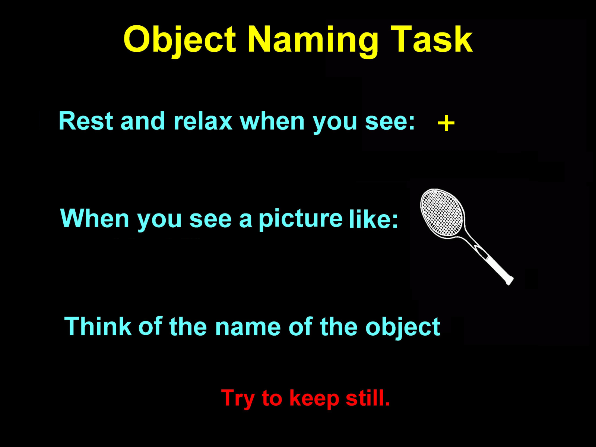

### 2.2.3. Rest Periods
During the rest periods of the paradigm a yellow cross or symbols are 
displayed, alternately for 1 second each (except 1.2s final period), centrally 
on a black background on the fMRI screen i.e.:

Cross-Symbols-Cross-Symbols...-Cross-Symbols

The cross is shown below:
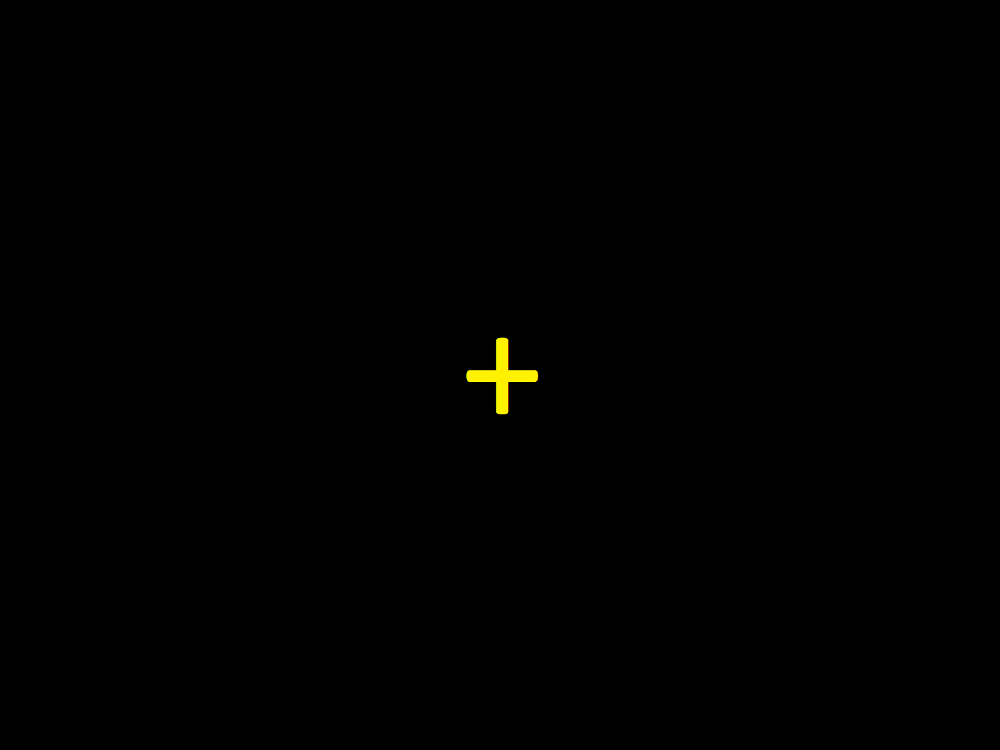

The symbols are chosen randomly from the following list:

1. */+^;@
2. |\£?:#
3. %=+\|£
4. $%^£&*
5. *$&^%"
6. @?£<*)
7. +_>~#"
8. !*^£:<
9. \#';/?&^
10. @-@:{)*
11. &"+`¬?.>

For example:
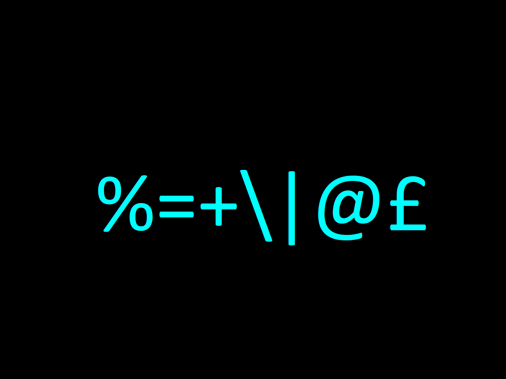

### 2.2.4. Task Periods
During the task periods of the paradigm a yellow cross or a picture of an object 
is displayed, alternately for 1 second each (except 1.2s final period), centrally 
on a black background on the fMRI screen i.e.:

Cross-Object-Cross-Object-...-Cross-Object

The same cross, as shown [above](#223-rest-periods), is used.

The objects are chosen randomly from this set of 
[pictures](./fmri_paradigms/picture_naming/resources/objects). 

### 2.2.5. PsychoPy Experiment
The files needed to run this paradigm in [PsychoPy](https://www.psychopy.org/) 
can be found [here](fmri_paradigms/picture_naming).

## 2.3. Laterality of Language Activations with Verbal Fluency
### 2.3.1. Design and Timing
The paradigm has a block-design as described [above](#221-design-and-timing).

### 2.3.2. Instructions
Prior to the start of data acquisition a set of instructions are displayed on 
the fMRI screen as shown below:

### 2.3.3. Rest Periods
During the rest periods of the paradigm a yellow cross, as shown 
[above](#223-rest-periods), is displayed centrally on a black background on 
the fMRI screen. 

### 2.3.4. Task Periods
During the task periods of the paradigm letters, drawn at random from the 
English alphabet (excluding the letters H,I,J,K,Q,W,X and Y) are displayed 
centrally on a black background on the fMRI screen, e.g.:
 

### 2.3.5. PsychoPy Experiment
The files needed to run this paradigm in [PsychoPy](https://www.psychopy.org/) 
can be found [here](fmri_paradigms/verbal_fluency).

## 2.4. Laterality of Language Activations with Verb Generation
### 2.4.1. Design and Timing
The paradigm has a block-design as described [above](#221-design-and-timing).

### 2.4.2. Instructions
Prior to the start of data acquisition a set of instructions are displayed on 
the fMRI screen as shown below:

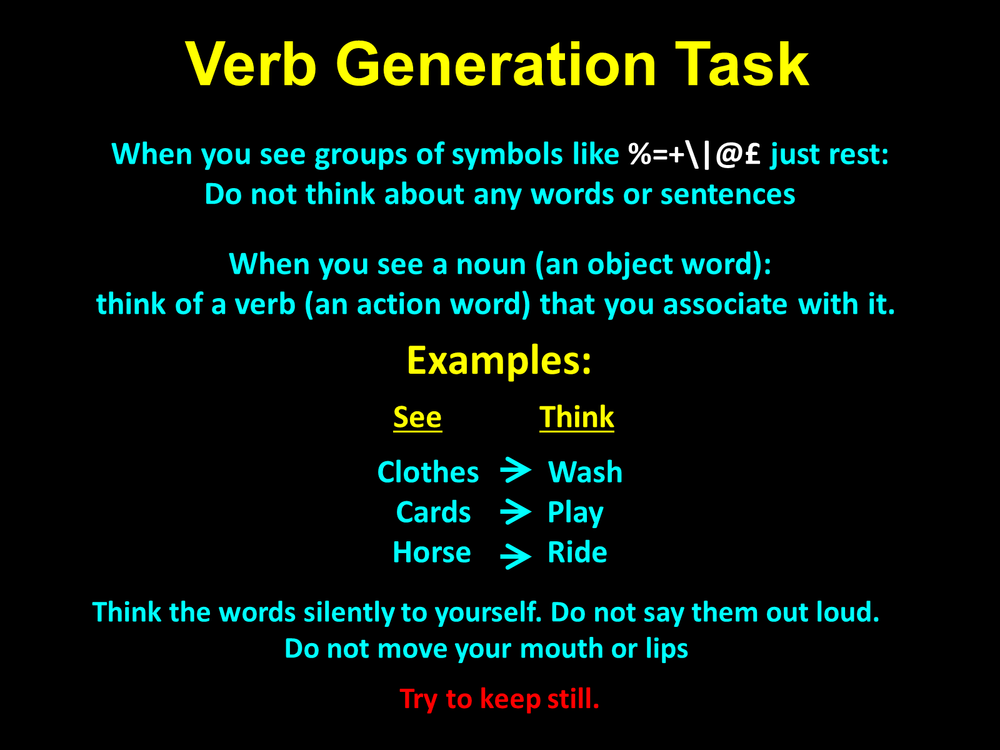

### 2.4.3. Rest Periods
The rest periods are the same as for the picture naming task with alternating
 symbols and cross images as described [above](#223-rest-periods).

### 2.4.4. Task Periods
During the task periods of the paradigm a yellow cross or nouns are 
displayed, alternately for 1 second each (except 1.2s final period), centrally 
on a black background on the fMRI screen i.e.:

Cross-Nouns-Cross-Nouns-...-Cross-Nouns

The same cross, as shown [above](#223-rest-periods), is used.

The nouns are chosen randomly from the following list:

_air, ball, baton, bell, bench, bike, book, bug, basket, bed, blanket, boat, 
beer, bread, brick, broom, cane, cup, chair, car, carpet, cat, crayon, cigar,
cloud, chess, doll, dollar, door, dog, dress, fan, finger, flag, fire, fork,
food, fist, foot, gift, grape, gun, glove, gum, hammer, house, hand, horse,
horn, ice, jet, juice, knife, ladder, lake, lawn, letter, milk, movie, mouse,
match, money, music, mouth, needle, oar, oven, pen, paper, phone, pill, plane,
pool, purse, pillow, radio, rope, ruler, razor, seed, shirt, song, stove, scale,
soap, shoes, table, tree, train, towel, violin, wood, wheel, wine, water or yarn_

For example:

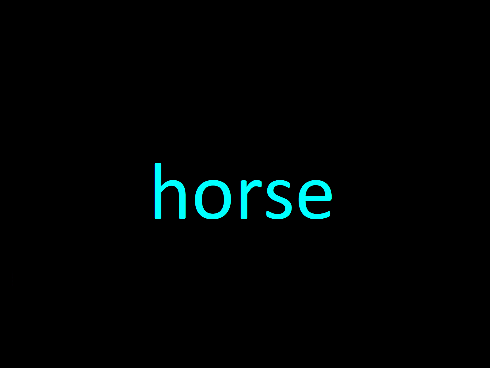

### 2.4.5. PsychoPy Experiment
The files needed to run this paradigm in [PsychoPy](https://www.psychopy.org/) 
in a number of different languages can be found [here](./fmri_paradigms/verb_generation).

>[!NOTE] 
>The instruction page is always shown in English. You will need to 
>explain the task to the subject if they cannot read English.

## 2.5. Motor Activations of the Left Hand
### 2.5.1. Design and Timing
The paradigm has a block-design as described [above](#221-design-and-timing).

### 2.5.2. Instructions
Prior to the start of data acquisition a set of instructions are displayed on 
the fMRI screen as shown below:
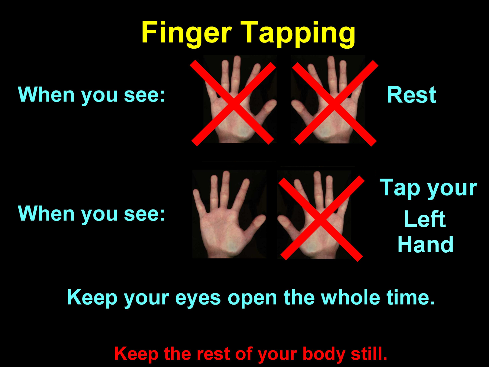

### 2.5.3. Rest Periods
During the rest periods of the paradigm the following image is displayed on the 
fMRI screen i.e. the subject keeps both hands still: 
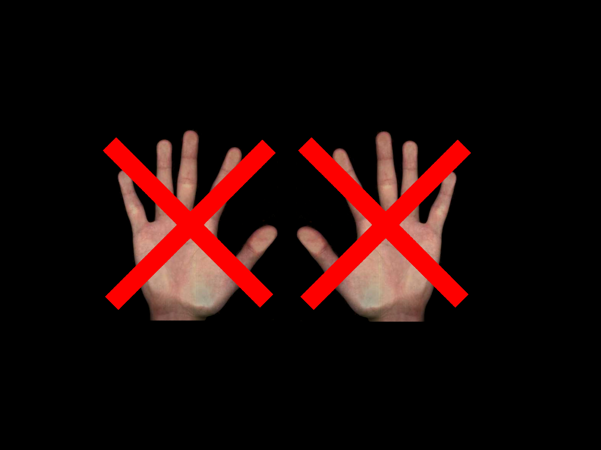

### 2.5.4. Task Periods
During the task periods of the paradigm the following image is displayed on the 
fMRI screen: 
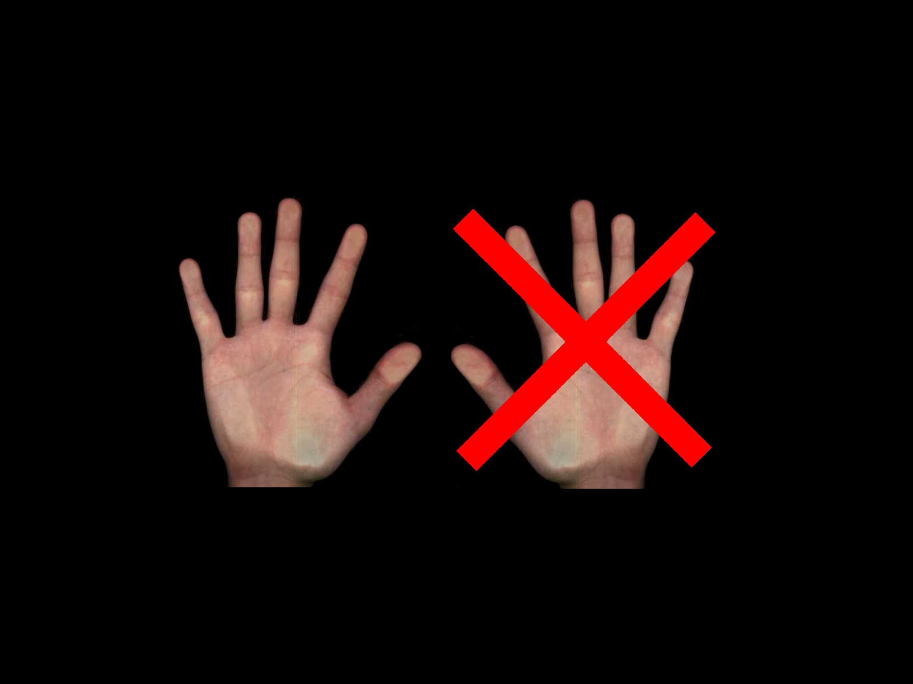

### 2.5.5. PsychoPy Experiment
The files needed to run this paradigm in [PsychoPy](https://www.psychopy.org/) 
can be found [here](fmri_paradigms/hands).

## 2.6. Motor Activations of the Right Hand
### 2.6.1. Design and Timing
The paradigm has a block-design as described [above](#221-design-and-timing).

### 2.6.2. Instructions
Prior to the start of data acquisition a set of instructions are displayed on 
the fMRI screen as shown below:
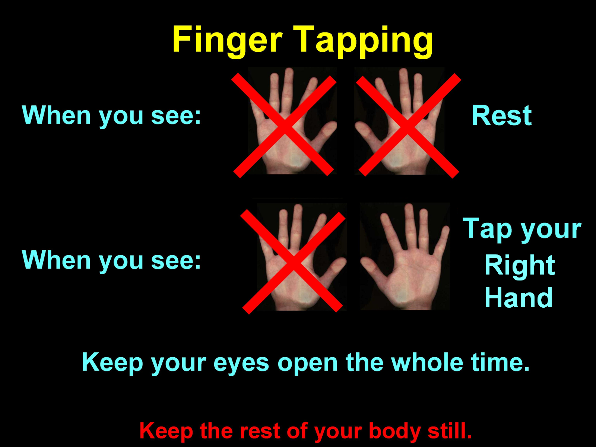

### 2.6.3. Rest Periods
During the rest periods of the paradigm the following image is displayed on the 
fMRI screen i.e. the subject keeps both hands still: 

### 2.6.4. Task Periods
During the task periods of the paradigm the following image is displayed on the 
fMRI screen: 
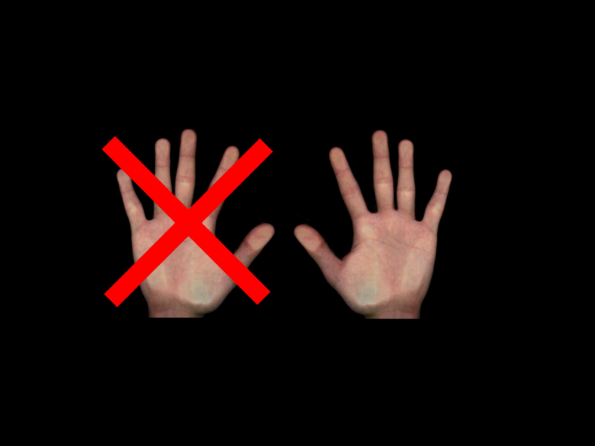

### 2.6.5. PsychoPy Experiment
The files needed to run this paradigm in [PsychoPy](https://www.psychopy.org/) 
can be found [here](fmri_paradigms/hands).

## 2.7. Motor Activations of the Both Hands
### 2.7.1. Design and Timing
The paradigm has a block-design with alternating periods of rest (18.2 seconds)
and two tasks (each 18.2 seconds long) that repeat for the duration of the 
fMRI data acquisition (164 measurements i.e. 437.9 seconds). The paradigm 
starts with a rest period i.e.:

Rest-Right Hand-Left Hand-Rest-Right Hand-Left Hand-Rest-Left Hand-Right Hand-Rest-Left Hand-Right Hand-Rest-Right Hand-Left Hand-Rest-Right Hand-Left Hand-Rest-Left Hand-Right Hand-Rest-Left Hand-Right Hand

>[!NOTE] 
>The order within each "Left Hand, Right Hand" task pair was selected 
>at random.

### 2.7.2. Instructions
Prior to the start of data acquisition a set of instructions are displayed on 
the fMRI screen as shown below:
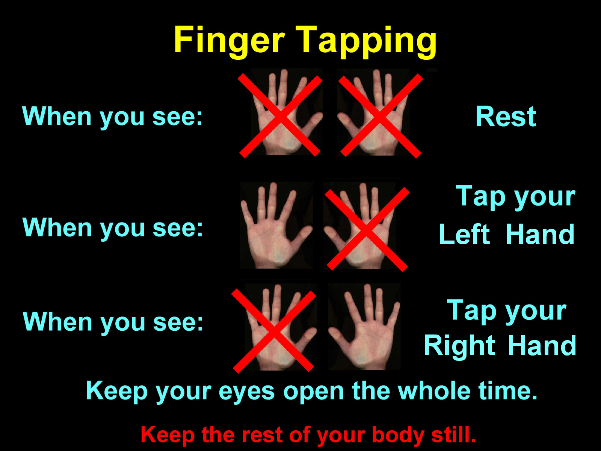

### 2.7.3. Rest Periods
During the rest periods of the paradigm the following image is displayed on the 
fMRI screen i.e. the subject keeps both hands still: 

### 2.7.4. Task Periods
During the task periods of the paradigm the either the left hand or right hand 
image is displayed on the fMRI screen as described [above](#271-design-and-timing).

### 2.7.5. PsychoPy Experiment
The files needed to run this paradigm in [PsychoPy](https://www.psychopy.org/) 
can be found [here](fmri_paradigms/hands).

## 2.8. Motor Activations of the Left Foot
### 2.8.1. Design and Timing
The paradigm has a block-design as described [above](#221-design-and-timing).

### 2.8.2. Instructions
Prior to the start of data acquisition a set of instructions are displayed on 
the fMRI screen as shown below:
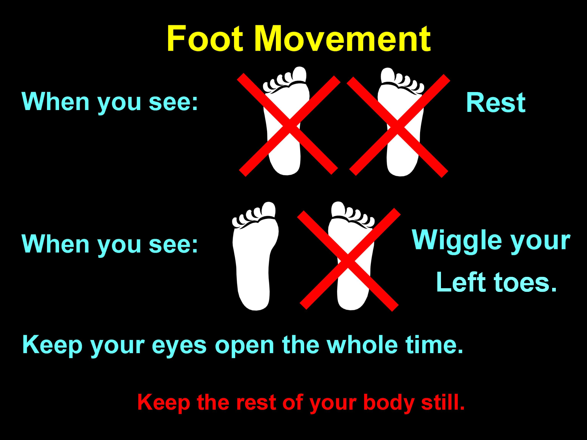

### 2.8.3. Rest Periods
During the rest periods of the paradigm the following image is displayed on the 
fMRI screen i.e. the subject keeps both feet still: 

### 2.8.4. Task Periods
During the task periods of the paradigm the following image is displayed on the 
fMRI screen: 
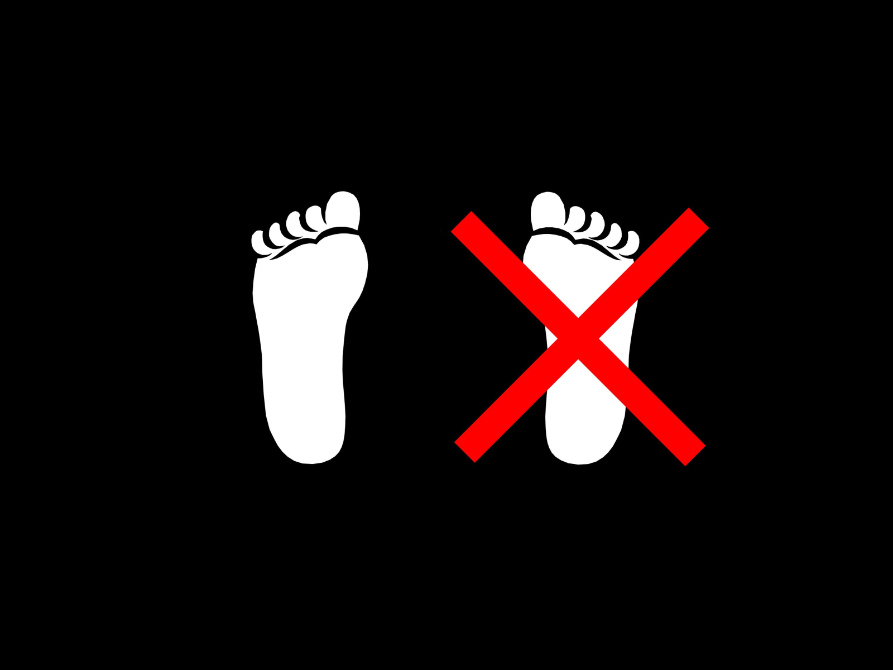

### 2.8.5. PsychoPy Experiment
The files needed to run this paradigm in [PsychoPy](https://www.psychopy.org/) 
can be found [here](fmri_paradigms/feet).

## 2.9. Motor Activations of the Right Foot
### 2.9.1. Design and Timing
The paradigm has a block-design as described [above](#221-design-and-timing).

### 2.9.2. Instructions
Prior to the start of data acquisition a set of instructions are displayed on 
the fMRI screen as shown below:
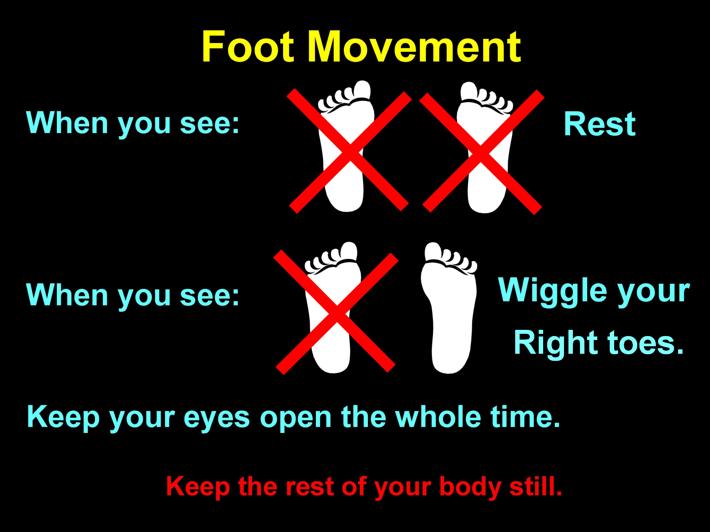

### 2.9.3. Rest Periods
During the rest periods of the paradigm the following image is displayed on the 
fMRI screen i.e. the subject keeps both feet still: 

### 2.9.4. Task Periods
During the task periods of the paradigm the following image is displayed on the 
fMRI screen: 
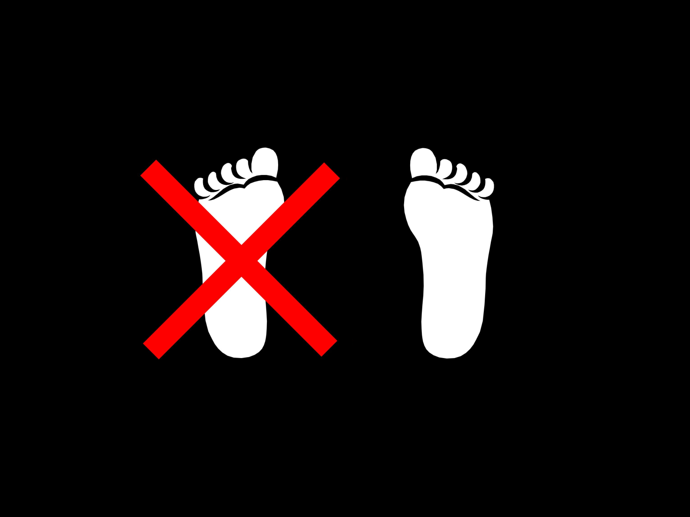

### 2.9.5. PsychoPy Experiment
The files needed to run this paradigm in [PsychoPy](https://www.psychopy.org/) 
can be found [here](fmri_paradigms/feet).

## 2.10. Motor Activations of Both Feet
### 2.10.1. Design and Timing
The paradigm has a block-design with alternating periods of rest (18.2 seconds)
and two tasks (each 18.2 seconds long) that repeat for the duration of the 
fMRI data acquisition (164 measurements i.e. 437.9 seconds). The paradigm 
starts with a rest period i.e.:

Rest-Right Foot-Left Foot-Rest-Right Foot-Left Foot-Rest-Left Foot-Right Foot-Rest-Left Foot-Right Foot-Rest-Right Foot-Left Foot-Rest-Right Foot-Left Foot-Rest-Left Foot-Right Foot-Rest-Left Foot-Right Foot
>[!NOTE]
>The order within each "Left Foot, Right Foot" task pair was selected 
>at random.

### 2.10.2. Instructions
Prior to the start of data acquisition a set of instructions are displayed on 
the fMRI screen as shown below:
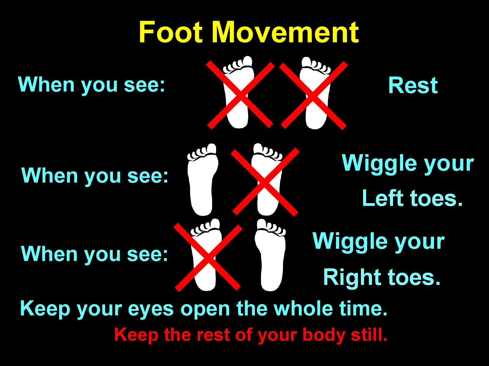

### 2.10.3. Rest Periods
During the rest periods of the paradigm the following image is displayed on the 
fMRI screen i.e. the subject keeps both feet still: 

### 2.10.4. Task Periods
During the task periods of the paradigm the either the left foot or right foot 
image is displayed on the fMRI screen as described [above](#2101-design-and-timing).

### 2.10.5. PsychoPy Experiment
The files needed to run this paradigm in [PsychoPy](https://www.psychopy.org/) 
can be found [here](fmri_paradigms/feet).

## 2.11. Motor Activations of the Lips
### 2.11.1. Design and Timing
The paradigm has a block-design as described [above](#221-design-and-timing).

### 2.11.2. Instructions
Prior to the start of data acquisition a set of instructions are displayed on 
the fMRI screen as shown below:
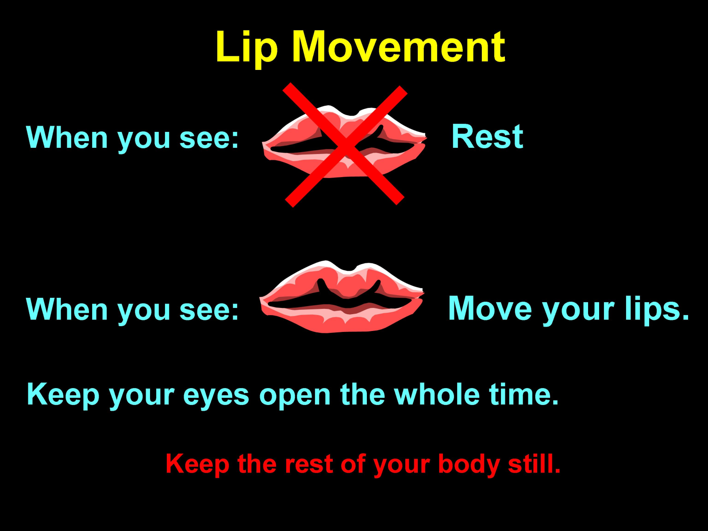

### 2.11.3. Rest Periods
During the rest periods of the paradigm the following image is displayed on the 
fMRI screen: 

### 2.11.4. Task Periods
During the task periods of the paradigm the following image is displayed on the 
fMRI screen: 

### 2.11.5. PsychoPy Experiment
The files needed to run this paradigm in [PsychoPy](https://www.psychopy.org/) 
can be found [here](fmri_paradigms/lips).

## 2.12. Sensory Activations of the Hands
To test sensory activations of the hand(s) we use the same paradigm as for 
motor activations except that instead of asking the subject to tap their 
fingers a member of staff strokes the palm of the subject's hand(s).

## 2.13. Sensory Activations of the Feet
To test sensory activations of the foot/feet we use the same paradigm as for 
motor activations except that instead of asking the subject to move their 
toes a member of staff strokes the top of the subject's foot/feet.

## 2.14. Visual Activations
### 2.14.1. Design and Timing
The paradigm has a block-design with alternating 15.6 s second periods of rest 
and task that repeat for the duration of the fMRI data acquisition 
(103 measurements i.e. 278.1 seconds). The paradigm starts with a rest period 
i.e.:

Rest-Task-Rest-Task-...-Rest-Task

Therefore the task onsets occur at 15.6, 46.8, 78, 109.2, 140.4, 171.6, 202.8, 
234 and 265.2 seconds.

### 2.14.2. Instructions
Prior to the start of data acquisition a set of instructions are displayed on 
the fMRI screen as shown below:
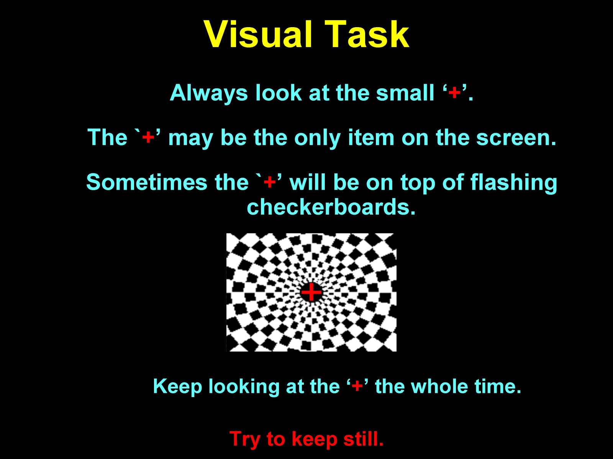

### 2.14.3. Rest Periods
During the rest periods of the paradigm a red cross is displayed centrally
on a grey background on the fMRI screen i.e.:
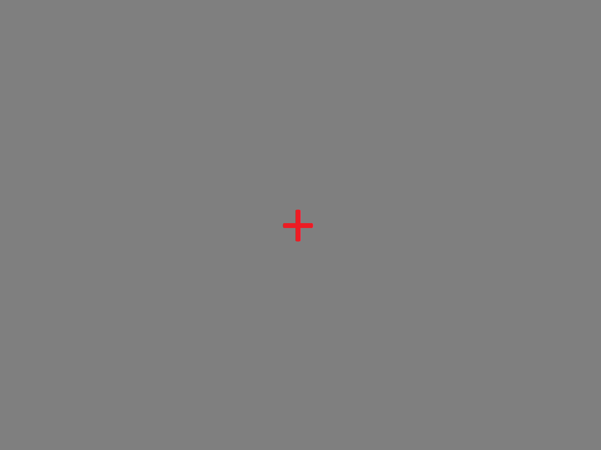

### 2.14.4. Task Periods
During the task periods of the paradigm there is an irregularly-timed
chequerboard flash. One of the two images shown below are displayed on the 
fMRI screen for between 50 and 250 ms.  

Image 1:
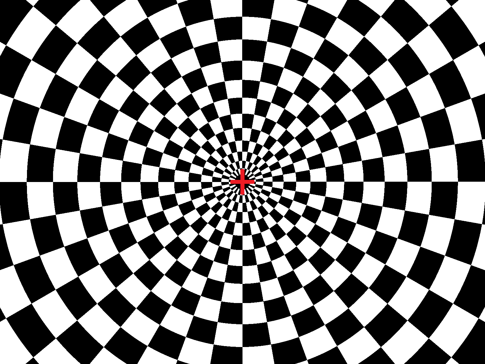

Image 2:
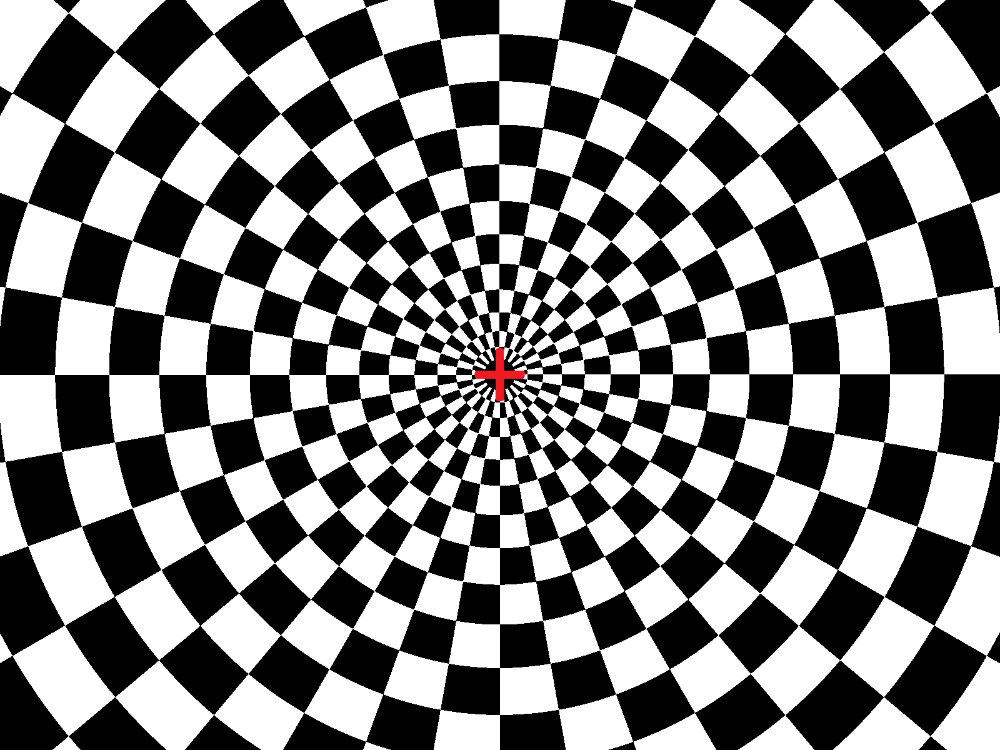

For example:

### 2.14.5. PsychoPy Experiment
The files needed to run this paradigm in [PsychoPy](https://www.psychopy.org/) 
can be found [here](fmri_paradigms/visual).

## 2.15. Assessing Handedness
When measuring the laterality of language activations with fMRI we assess 
the subject's handedness using an
[Edinburgh Handedness Inventory](https://www.brainmapping.org/shared/Edinburgh.php) 
(EHI) created by Mark S. Cohen based on a 
[paper](https://doi.org/10.1016/0028-3932(71)90067-4) by Richard C. Oldfield.

### 2.15.1. Questionnaire
For each of the 15 activities in the 
[questionnaire](./fmri_paradigms/EHI.pdf) the subject 
is asked 

_"Which hand do you prefer to use?"_ and _"Do you ever use the other 
hand?"_

### 2.15.2. Scoring
The range of possible responses to each question are shown in the table below 
together with their respective score:

| Left | No Preference | Right | Do you ever use the other hand?| Score |
|:---:|:---:|:---:|:---:|:---:|
| :heavy_check_mark: |   |   |   | L=2 | 
| :heavy_check_mark: |   |   | :heavy_check_mark: | L=1 | 
|   | :heavy_check_mark: |   |   | R=1, L=1 | 
|   |   | :heavy_check_mark: | :heavy_check_mark: | R=1 | 
|   |   |   | :heavy_check_mark:  | R=2 | 

### 2.15.3. Handedness Index

The Edinburgh Handedness Index (EHI), as a percentage, is calculated using:

$EHI = \frac{R_{total} - L_{total}}{30} \times 100$%

Where $L_{total}$ is the sum of the L scores and $R_{total}$ is the sum of the 
R scores for all 15 activities.