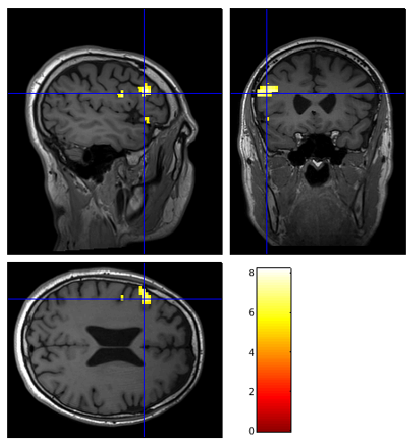

# 3. fMRI Data Analysis Pipeline
## 3.1. Introduction
We analyse functional MRI data with 
[SPM](https://www.fil.ion.ucl.ac.uk/spm/software/spm12/). We convert 
[DICOM](https://dicom.nema.org/) data from the MRI scanner to 
[NIfTI](https://nifti.nimh.nih.gov/) format using 
[dcm2niix](https://github.com/rordenlab/dcm2niix). We use 
[FSLeyes](https://fsl.fmrib.ox.ac.uk/fsl/fslwiki/FSLeyes) to display the final 
results of the analysis and to perform some quality control checks. 

We perform the following processing and quality control checks on the functional
 MRI data:
1. [Convert from the DICOM images to NIfTI format](#333-convert-the-dicom-data-to-nifti-format)
2. [Organise the NIfTI data into relevant directories](#33-prepare-the-data-for-analysis)
3. [Check the fMRI and structural images for artefacts](#34-perform-quality-control-checks)
4. Correct the fMRI images for subject motion and susceptibility-by-movement 
interaction
5. Co-register the fMRI images to the structural images
6. Co-register the structural images to one another
7. Spatially smooth the fMRI images
8. Calculate t-statistic images using the General Linear Model (GLM)
9. Re-slice the t-statistic images into the same space as the structural images
10. [Check the quality of the output(s) of each processing step](#37-perform-quality-control-checks)
11. [View the re-sliced and thresholded t-statistic images overlayed on the structural images](#38-view-the-threshold-t-statistic-maps)

>[!TIP]
>The [FSL wiki](https://fsl.fmrib.ox.ac.uk/fsl/fslwiki/FEAT/UserGuide#Appendix_A:_Brief_Overview_of_GLM_Analysis) 
>has a very accessible overview of the General Linear Model (GLM).

## 3.2. Install Software
1. Install [dcm2niix](https://github.com/rordenlab/dcm2niix) by following the 
instructions in the GitHub repository.
2. Install [FSL](https://fsl.fmrib.ox.ac.uk/fsl/fslwiki) by following the 
instructions on the 
[wiki](https://fsl.fmrib.ox.ac.uk/fsl/fslwiki/FSLInstallation).
3. Install [SPM](https://www.fil.ion.ucl.ac.uk/spm/software/spm12/) by following 
the instructions in the 
[online documentation](https://www.fil.ion.ucl.ac.uk/spm/docs/installation/). 

## 3.3. Prepare the Data for Analysis
Organise and convert the [DICOM](https://dicom.nema.org/) files from the fMRI 
study:

### 3.3.1. Open SPM
1. Start [MATLAB](https://uk.mathworks.com)
   
2. Open [SPM](https://www.fil.ion.ucl.ac.uk/spm/software/spm12/) by typing in 
the [MATLAB](https://uk.mathworks.com) Command Window:
    ```matlab
    spm fmri
    ``` 
### 3.3.2. Create Directories
Make directories to store the data and the results of the analysis for the 
subject by typing in the [MATLAB](https://uk.mathworks.com) Command Window:

```matlab
spm_mkdir('SURNAME_firstname','dcm')
spm_mkdir('SURNAME_firstname','ana',{'fmap','fmri_results','fmri_task_1','structural'})
```

>[!TIP]
>Replace `SURNAME_firstname` with the subject's name 

>[!TIP]
>Name the fMRI series according to the paradigm performed e.g. 
>`fmri_verb_generation` or `fmri_motor_right_hand` etc... 
> It is simply called `fmri_task_1` here as this is a generic example.

### 3.3.3. Convert the DICOM Data to NIfTI Format
1. Move the [DICOM](https://dicom.nema.org/) files from the fMRI study of the 
subject into the `dcm` directory using either the `Current Folder` window in 
[MATLAB](https://uk.mathworks.com) or the `movefile` command in the 
[MATLAB](https://uk.mathworks.com) Command Window.

2. Convert from [DICOM](https://dicom.nema.org/) to 
[NIfTI](https://nifti.nimh.nih.gov/) format using 
[dcm2niix](https://github.com/rordenlab/dcm2niix). For example, if you are 
using a UNIX-like operating system, such as 
[Debian linux](https://www.debian.org/), type the following at the command 
prompt:
    ```bash
    dcm2niix -o ana -f %4s-%d dcm
    ```
>[!TIP] 
>Make sure you are in the `SURNAME_firstname` directory before running the 
>`dcm2niix` command. You can use the `cd` command to change directory as needed.

### 3.3.4. Move the NIfTI Files
1. Change to the ana directory by typing in the 
[MATLAB](https://uk.mathworks.com) Command Window:
     ```matlab
     cd ana
     ```

2. Move the [NIfTI](https://nifti.nimh.nih.gov/) and 
[JSON](https://www.json.org) files created by 
[dcm2niix](https://github.com/rordenlab/dcm2niix) to the relevant 
directories. For example if the following series where acquired:

    | Series Number | Series Description | NIfTI Filename(s) |
    |:---:|---|---|
    | 1 | t1_space      | `0001-t1_space.nii`  | 
    | 2 | fmri_task_1  | `0002-fmri_task_1.nii`  | 
    | 3 | gre_fieldmap  | `0003-gre_fieldmap_e1.nii`, `0003-gre_fieldmap_e2.nii` |   
    | 4 | gre_fieldmap | `0004-gre_fieldmap_e2_ph.nii`  |
    | 5 | t2_space      | `0005-t2_space.nii`  | 
    | 6 | t2_flair_space | `0006-t2_flair_space.nii`  | 

    ```matlab
    movefile 0001-t1_space.* structural
    movefile 0002-fmri_task_1.* fmri_task_1
    movefile 0003-gre_fieldmap_e1.* fmap
    movefile 0003-gre_fieldmap_e2.* fmap
    movefile 0004-gre_fieldmap_e2_ph.* fmap
    movefile 0005-t2_space.* structural
    movefile 0006-t2_flair_space.* structural
    ```
    
    This should result in the following arrangement of files and directories:
    ```bash
    .
    └── ana
        ├── fmap
        │   ├── 0003-gre_fieldmap_e1.json
        │   ├── 0003-gre_fieldmap_e1.nii
        │   ├── 0003-gre_fieldmap_e2.json
        │   ├── 0003-gre_fieldmap_e2.nii
        │   ├── 0004-gre_fieldmap_e2_ph.json
        │   └── 0004-gre_fieldmap_e2_ph.nii
        ├── fmri_results
        ├── fmri_task_1
        │   ├── 0002-fmri_task_1.json
        │   └── 0002-fmri_task_1.nii
        └── structural
            ├── 0001-t1_space.json
            ├── 0001-t1_space.nii
            ├── 0005-t2_space.json
            ├── 0005-t2_space.nii
            ├── 0006-t2_flair_space.json
            └── 0006-t2_flair_space.nii
    ```

>[!TIP]
>Name the fMRI series according to the paradigm performed e.g. 
>`fmri_verb_generation` or `fmri_motor_right_hand` etc... 
>It is simply called `fmri_task_1` here as this is a generic example.

>[!TIP] 
>If the `dcm` directory contained diffusion data `dcm2niix` will have converted
>it to NIfTI format and saved the files in the `ana` directory. These NIfTI 
>and corresponding JSON files can be deleted as they are not required.

## 3.4. Perform Quality Control Checks
>[!IMPORTANT]
>Before analysing the fMRI study data it is vital to check for artefacts such 
>as signal dropout, distortion, subject motion, ghosts or other failures in the 
>acquisition. It may be necessary to repeat the acquisition if 
>the artefacts are too severe. Images can be viewed directly within 
>[SPM](https://www.fil.ion.ucl.ac.uk/spm/software/spm12/) or in an alternative 
>[NIfTI](https://nifti.nimh.nih.gov/) viewer such as 
>[FSLeyes](https://fsl.fmrib.ox.ac.uk/fsl/fslwiki/FSLeyes) as explained below.

### 3.4.1. Structural Images
Visually check the structural images (T1, T2 and T2-FLAIR) for artefacts as
explained below:

#### 3.4.1.1. SPM GUI
1. From the SPM Menu window select `Display`. In the pop-up window select the 
first structural image  e.g. `structural/0001-t1_space.nii` then click `Done`.
    

>[!TIP]
>See the [video walk-through](https://www.fil.ion.ucl.ac.uk/spm/docs/tutorials/fmri/block/preprocessing/visual_inspection/#video-walk-through)
>in the online SPM documentation for further help using the `Display` tool.

2. Look through the image in the SPM graphics window using your mouse to 
change the location of the cross-hairs.

3. Check the other structural images i.e. `structural/0005-t2_space.nii` and
`structural/0006-t2_flair_space.nii` in the same way.

#### 3.4.1.2. SPM Command Line
Alternatively, the images can be opened in the `Display` tool by typing the 
following in the [MATLAB](https://uk.mathworks.com) Command Window:
```matlab
spm_image('Display','structural/0001-t1_space.nii')
```

#### 3.4.1.3. FSLeyes
As another alternative, the images can be viewed with 
[FSLeyes](https://fsl.fmrib.ox.ac.uk/fsl/fslwiki/FSLeyes) by typing at the 
command prompt:

```bash
fsleyes structural/0001-t1_space.nii structural/0005-t2_space.nii structural/0006-t2_flair_space.nii
```


>[!TIP]
>Look through all of the slices using your mouse to change the location of the 
>cross-hairs.

### 3.4.2. fMRI Data
As fMRI data is 4D (a time-series of 3D volumes) it is viewed using different 
tools to the structural images:
 
#### 3.4.2.1. SPM GUI
1. From the SPM Menu window select `Check Reg`. In the pop-up window select the 
first fMRI volume e.g. `fmri_task_1/0002-fmri_task_1.nii,1` then click `Done`.

2. Right-click on the fMRI image in the Graphics window. Click `Browse...`. 
In the pop-up window click on the selected image to remove it. In the filter 
field type `^0.*\.nii$`. In the frames field type `Inf`. Right click over the 
list of fMRI images and click `Select all`. Click `Done`. 

3. In the Graphics click the `>` button to scroll through the fMRI volumes to 
look for artefacts. 
    
    
>[!TIP]
> See the [video walk-through](https://www.fil.ion.ucl.ac.uk/spm/docs/tutorials/fmri/block/preprocessing/visual_inspection/#video-walk-through_1)
> in the SPM documentation for further help using the `Check Reg` tool.

#### 3.4.2.2. SPM Command Line
Alternatively the images can be opened in the `Check reg` tool by typing the 
following in the [MATLAB](https://uk.mathworks.com) Command Window:

```matlab
spm_check_registration(spm_select('Expand','fmri_task_1/0002-fmri_task_1.nii'));
```

In the Graphics click the `>` button to scroll through the fMRI volumes to 
look for signal dropout, distortion, subject motion.

#### 3.4.2.3. FSLeyes
As a further alternative the images can be viewed with 
[FSLeyes](https://fsl.fmrib.ox.ac.uk/fsl/fslwiki/FSLeyes).
1. Open [FSLeyes](https://fsl.fmrib.ox.ac.uk/fsl/fslwiki/FSLeyes) by typing at 
the command prompt:
    ```bash
    fsleyes fmri_task_1/0002-fmri_task_1.nii
    ```

    

2. Scroll through the fMRI volumes using the `Volumes` field in the `Location` 
panel to check for artefacts.

## 3.5. Create an Acquisition and Paradigm Specific SPM Batch File 
An example [batch file](./spm_batches/one_task_template_job.m) that includes all the processing 
modules we recommend is included in this repository. As explained in the online 
[tutorial](https://www.fil.ion.ucl.ac.uk/spm/docs/tutorials/fmri/block/preprocessing/batch/):

>The SPM batch interface allows you to create workflows for executing 
>multiple processing steps sequentially. This means that you can set up one 
>batch file that contains all preprocessing steps that you want to perform. 

The purpose of each module is explained in the table below:

|Module Number | Module Name| Purpose| 
|:---:|---|---|
|1| `Named Directory Selector`| Prompt user to select the directory containing the fMRI data | 
|2| `File Selector (Batch Mode)`| Select the NIfTI file containing the fMRI data from the directory specified in module 1 |
|3| `Expand image frames`| Select the first volume of fMRI data from module 2 |
|4| `Calculate VDM`| Create voxel displacement map (VDM) from field map to un-warp geometric distortions in fMRI data selected in module 3 |
|5| `Expand image frames`| Select *all* the volumes of fMRI data from module 2 |
|6| `Image Calculator`| Calculate the temporal mean of the fMRI data selected in module 5|
|7| `Image Calculator`| Calculate the temporal variance of the fMRI data selected in module 5|
|8| `Realign & Unwarp`| Correct for subject motion and susceptibility-by-movement interaction in the fMRI data selected in module 5 |
|9| `Named File Selector`| Prompt user to select the T1-weighted structural MRI NIfTI file |
|10| `Coregister: Estimate`| Co-register the mean un-warped fMRI image from module 8 to the structural image selected in module 9 |
|11| `Smooth`| Spatially smooth the fMRI data from module 10 |
|12| `File Selector (Batch Mode)`| Select the smoothed fMRI data from module 11 |
|13| `Named Directory Selector`| Set the fMRI results directory to `fmri_results`|
|14| `fMRI model specification`| Prompt user to specify the repetition time of the fMRI data and the timing parameters of the fMRI paradigm |
|15| `Model estimation`| Calculate the images of parameter estimates using the data selected in module 12, and the specification from module 14 |
|16| `Contrast manager`| Calculate the t-contrast and t-statistic images using the parameter estimates from module 15 and the specification from module 14 |
|17| `File Selector (Batch Mode)`| Select the t-statistic images from the `fmri_results` directory |
|18| `Coregister: Reslice`| Re-slice the t-statistic images selected in module 17 into structural space using the parameters estimated in module 10 |
|19| `File Selector (Batch Mode)`| Select the mean un-warped fMRI image from module 10 |
|20| `Coregister: Reslice`| Re-slice the mean un-warped fMRI image selected in module 17 into structural space using the parameters estimated in module 10 |
|21| `Coregister: Estimate & Reslice`| Co-register the T2-weighted structural image to the T1-weighted structural image | 
|22| `Coregister: Estimate & Reslice`| Co-register the T2-FLAIR-weighted structural image to the T1-weighted structural image |    

>[!TIP]
>A detailed description of each module and its associated options can be found 
>in the SPM [manual](https://www.fil.ion.ucl.ac.uk/spm/doc/spm12_manual.pdf).

Follow the instructions below to create and save a customised version of 
this batch file with your acquisition and paradigm timing parameters.

### 3.5.1. Open the Batch File
1. Open the Batch Editor by clicking the `Batch` button in the SPM menu window

2. In the Batch Editor, select `Load Batch` from the `File` menu. Load 
the example [batch file](./spm_batches/one_task_template_job.m).

    

### 3.5.2. Customise the Calculate VDM module
1. In the Batch Editor select `Calculate VDM` from the module list.

2. Select `.... Echo times <-X` click `Specify...`. In the pop-up window type 
the echo times in ms from the field map series. For our 
[acquisition protocol](./1_Acquisition_Protocol.md) they are `4.92 7.38`.

>[!TIP]
>The echo times, in seconds, can be found in `fmap/0003-gre_fieldmap_e1.json` 
>and `fmap/0004-gre_fieldmap_e2.json`. 

3. Select `.... Blip direction <-X` click `Specify...`. In the pop-up window 
type the phase-encode direction. For our 
[acquisition protocol](./1_Acquisition_Protocol.md) it is `-1` as the phase 
encode direction is A>>P. As explained in the SPM documentation:

>The convention used to describe the direction of the k-space traversal is
> based on the coordinate system used by SPM. In this coordinate system, the 
>phase encode direction corresponds with the y-direction and is defined as 
>positive from the posterior to the anterior of the head. The x-direction 
>is defined as positive from left to right and the z-direction is defined 
>as positive from foot to head. The polarity of the phase-encode blips 
>describes in which direction k-space is traversed along the y-axis with 
>respect to the coordinate system described here.

>[!TIP]
>If the phase-encode direction of the fMRI images is A>>P then the blip 
>direction is -1. Whereas if the phase-encode direction is P>>A then the blip 
>direction is 1.

4. Select `.... Total EPI readout time <-X` click `Specify...`. In the pop-up 
window type the EPI readout time in ms. For our 
[acquisition protocol](./1_Acquisition_Protocol.md) it would be `17.64`. 

>[!TIP]
>The EPI readout time can be found in `fmri_task_1/0002-fmri_task_1.json`. In 
>the JSON file it is called `TotalReadoutTime` and is in units of seconds.

5. Select `..... Template image for brain masking <-X` click `Specify...`. In 
the pop-up window select the `T1.nii` template from the FieldMap toolbox. 

>[!TIP]
>If you installed [SPM](https://www.fil.ion.ucl.ac.uk/spm/software/spm12/) 
>in `/home/username/spm12` then the template will be in
>`/home/username/spm12/toolbox/FieldMap/T1.nii`.

### 3.5.3. Customise the fMRI model specification module
1. In the Batch Editor select `fMRI model specification` from the Module List.

2. Select `. Interscan interval <-X`, click `Specify...`. In the pop-up 
window type the repetition time in seconds. For our 
[acquisition protocol](./1_Acquisition_Protocol.md) it is `2.67`.

>[!TIP]
>The repetition time, in seconds, can be found in 
>`fmri_task_1/0002-fmri_task_1.json`

3. Select `.... Name <-X`, click `Specify...`. In the pop-up window
type the name of the paradigm e.g. `fluency` and click `Done`.

4. Select `.... Onsets <-X`, click `Specify...`. In the pop-up window 
type in the task onsets e.g. for the 
[verbal fluency paradigm](./fmri_paradigms/laterality_of_language/verbal_fluency/Verbal_Fluency.md) 
they are `18.2 54.6 91 127.4 163.8 200.2 236.6 273`

5. Select `.... Durations <-X`, click `Specify...`. In the pop-up window 
type the task duration e.g. for the 
[verbal fluency paradigm](./fmri_paradigms/laterality_of_language/verbal_fluency/Verbal_Fluency.md) 
it is `18.2` seconds.

### 3.5.4. Customise the Contrast module
1. In the Batch Editor select `Contrast Manager` from the Module List. 

2. Select `.. Name <-X`, click `Specify...`. In the pop-up window type the name 
of the contrast e.g. `fluency` and click `Done`.

### 3.5.5. Save the Customised Batch File    
1. In the Batch Editor, select `Save Batch and Script` from the `File` menu. 

2. Save the batch file a directory of your choice for use in subsequent analyses.
For example if you save it as `fluency`, the `.m` file you will load in 
future will be `fluency_job.m`.

>[!TIP]
>You can save a separate customised batch file for each fMRI paradigm with the 
>relevant `Name`, `Onsets` and `Durations` in the `fMRI model specification` and 
>`Contrast` modules.

## 3.6. Create and Run a Subject Specific SPM Batch File
Create an SPM batch file with all the subject specific details needed for an 
analysis.

### 3.6.1. Open the Batch File
1. Open the Batch Editor by clicking the `Batch` button in the SPM menu window

2. In the Batch Editor, select `Load Batch` from the `File` menu. Load 
the file you saved when you created a customised version of 
this batch file with your acquisition and paradigm timing parameters as 
described above.

### 3.6.2. Add Subject Specific Parameters to Batch File
1. In the Batch Editor select the first module `Named Directory Selector` from 
the Module List. Select `. Directory <-X`, click `Specify...`. In the pop-up 
window select the `fmri_task_1` directory and click `Done`.

2. In the Batch Editor select the 4th module `Calculate VDM` from the Module List.
    1. Select `.... Phase Image <-X`, click `Specify...`. In the pop-up window 
    select `fmap/0004-gre_fieldmap_e2_ph.nii` and click `Done`.
    2. Select `.... Magnitude Image <-X` click `Specify...`. In the pop-up window 
    select `fmap/0003-gre_fieldmap_e1.nii` and click `Done`.

3. In the Batch Editor select the 7th module `Named File Selector` from the Module List. 
Select `. File Set <-X`, click `Specify...`. In the pop-up window select the 
`structural/0001-t1_space.nii` directory and click `Done`.

5. In the Batch Editor select the 11th module `Named Directory Selector` from 
the Module List. Select `. Directory <-X`, click `Specify...`. In the pop-up 
window select the `fmri_results` directory and click `Done`.

6. In the Batch Editor select the penultimate module 
`Coregister: Estimate & Reslice` from the Module List. Select 
`Source Image <-X`, click `Specify...`. In the pop-up window select the 
`structural/0005-t2_space.nii` file and click `Done`.

7. In the Batch Editor select final module `Coregister: Estimate & Reslice` 
from the Module List. Select `Source Image <-X`, click `Specify...`. In the 
pop-up window select the `structural/0006-t2_flair_space.nii` file and click 
`Done`.

8. In the Batch Editor, select `Save Batch` from the `File` menu. Save the batch 
file in the `ana` directory so that you have a record of the analysis steps and 
parameters that were used for this subject.

9. Select `Run Batch` from the `File` menu. 

>[!TIP]
>The results of each module are displayed in the Graphics window and then 
>saved in Postscript file. The details of the files produced by the analysis 
>are explained below.

### 3.6.3. Outputs of Analysis
When the SPM analysis is complete a number of files will have been created, they
should be arranged as follows:

```bash
.
├── fmap
│  ├── 0003-gre_fieldmap_e1.json
│  ├── 0003-gre_fieldmap_e1.nii
│  ├── 0003-gre_fieldmap_e2.json
│  ├── 0003-gre_fieldmap_e2.nii
│  ├── 0004-gre_fieldmap_e2_ph.json
│  ├── 0004-gre_fieldmap_e2_ph.nii
│  ├── bmask0003-gre_fieldmap_e1.nii
│  ├── fpm_sc0004-gre_fieldmap_e2_ph.nii
│  ├── m0003-gre_fieldmap_e1.nii
│  ├── sc0004-gre_fieldmap_e2_ph.nii
│  └── vdm5_sc0004-gre_fieldmap_e2_ph.nii
├── fmri_results
│  ├── beta_0001.nii
│  ├── beta_0002.nii
│  ├── beta_0003.nii
│  ├── beta_0004.nii
│  ├── beta_0005.nii
│  ├── beta_0006.nii
│  ├── beta_0007.nii
│  ├── beta_0008.nii
│  ├── con_0001.nii
│  ├── mask.nii
│  ├── ResMS.nii
│  ├── RPV.nii
│  ├── rspmT_0001.nii
│  ├── SPM.mat
│  └── spmT_0001.nii
├── fmri_task_1
│  ├── 0002-fmri_task_1.json
│  ├── 0002-fmri_task_1.mat
│  ├── 0002-fmri_task_1.nii
│  ├── 0002-fmri_task_1_uw.mat
│  ├── fmri_temporal_mean.nii
│  ├── fmri_temporal_variance.nii
│  ├── meanu0002-fmri_task_1.nii
│  ├── rmeanu0002-fmri_task_1.nii
│  ├── rp_0002-fmri_task_1.txt
│  ├── smeanu0002-fmri_task_1.nii
│  ├── su0002-fmri_task_1.nii
│  ├── u0002-fmri_task_1.mat
│  ├── u0002-fmri_task_1.nii
│  └── wfmag_0002-fmri_task_1.nii
├── spm_2023Dec01.ps
├── task_1_job.m
├── task_1_fmri.m
└── structural
    ├── 0001-t1_space.json
    ├── 0001-t1_space.nii
    ├── 0005-t2_space.json
    ├── 0005-t2_space.nii
    ├── 0006-t2_flair_space.json
    ├── 0006-t2_flair_space.nii
    ├── r0005-t2_space.nii
    └── r0006-t2_flair_space.nii
```

The contents of each are explained in the table below:

| File | Source Module | Description | 
|---|---|---|
| `spm_{date}.ps`| All modules| PostScript file containing results from each module |
| `fmap/bmask0003-gre_fieldmap_e1.nii` | `Calculate VDM` | brain mask | 
| `fmap/m0003-gre_fieldmap_e1.nii` | `Calculate VDM`| bias corrected field map magnitude image| 
| `fmap/fpm_sc0004-gre_fieldmap_e2_ph.nii` | `Calculate VDM`| phase-unwrapped, regularised field map (Hz) | 
| `fmap/sc0004-gre_fieldmap_e2_ph.nii` | `Calculate VDM`| field map phase image scaled to radians -pi to pi | 
| `fmap/vdm5_sc0004-gre_fieldmap_e2_ph.nii` | `Calculate VDM` | voxel displacement map | 
| `fmri_task_1/wfmag_0002-fmri_task_1.nii` | `Calculate VDM` | field map magnitude image forward warped using VDM and co-registered to first fMRI volume | 
| `fmri_task_1/fmri_temporal_mean.nii` | `Image Calculator` | temporal mean of the fMRI data | 
| `fmri_task_1/fmri_temporal_variance.nii` | `Image Calculator` | temporal variance of the fMRI data | 
| `fmri_task_1/0002-fmri_task_1.mat` |`Realign & Unwarp` | MATLAB file containing realignment parameters as 4-by-4 transformation matrices |
| `fmri_task_1/0002-fmri_task_1_uw.mat` |`Realign & Unwarp` | MATLAB file containing structure of un-warp parameters and results |
| `fmri_task_1/meanu0002-fmri_task_1.nii` |`Realign & Unwarp` | mean un-warped fMRI image |  
| `fmri_task_1/rp_0002-fmri_task_1.txt` |`Realign & Unwarp` | realignment parameters (x,y, and z translations and pitch, yaw and roll in columns 1 to 6 respectively) |  
| `fmri_task_1/u0002-fmri_task_1.nii` |`Realign & Unwarp` | un-warped and realigned fMRI images* |
| `fmri_task_1/u0002-fmri_task_1.mat` |`Coregister: Estimate` | MATLAB file containing co-registration parameters as 4-by-4 transformation matrices |
| `fmri_task_1/smeanu0002-fmri_task_1.nii` |`Smooth` | smoothed mean un-warped fMRI images | 
| `fmri_task_1/su0002-fmri_task_1.nii` |`Smooth` | smoothed un-warped fMRI images | 
| `fmri_results/beta_0001.nii` | `Model estimation` | image of parameter estimate corresponding to column 1 of design matrix (in this case the block design convolved with the HRF) from `Model estimation` |
| `fmri_results/beta_0002.nii to beta_0008.nii` | `Model estimation`| images of parameter estimate corresponding to column 2-8 of design matrix (the motion regressors and a constant)  |
| `fmri_results/mask.nii` | `Model estimation`| brain mask  |
| `fmri_results/ResMS.nii` | `Model estimation` | estimated residual variance image (variance of the error)  |
| `fmri_results/con_0001.nii` | `Contrast Manager`| t-contrast image  |
| `fmri_results/RPV.nii` | `Contrast Manager` | estimated RESELS per voxel image (voxel-wise estimate of the local "roughness" of the residuals of the GLM fit, used when evaluating statistic thresholds that correct for multiple comparisons)  |
| `fmri_results/spmT_0001.nii` | `Contrast Manager` | t-statistic image |
| `fmri_results/SPM.mat` | `fMRI model specification`, `Contrast Manager` `Model estimation` and `Contrast Manager`| MATLAB file containing results from `fMRI model specification` and `Contrast Manager`  |
| `fmri_task_1/rmeanu0002-fmri_task_1.nii` | `Coregister: Reslice`| mean, un-warped fMRI image co-registered to T1-weighted structural image |  
| `fmri_results/rspmT_0001.nii` | `Coregister: Reslice` | t-statistic image co-registered to T1-weighted structural image  |
| `structural/r0005-t2_space.nii` | `Coregister: Estimate & Reslice` | T2-weighted structural image co-registered to T1-weighted structural image  |
| `structural/r0006-t2_flair_space.nii` | `Coregister: Estimate & Reslice` | T2-FLAIR-weighted structural image co-registered to T1-weighted structural image  |

>[!NOTE]
>`fmri_task_1/u0002-fmri_task_1.nii` is initially generated by 
>`Calculate VDM`. At that point it is a single un-warped fMRI volume, rather 
>than a complete time-series of un-warped images.

## 3.7. Perform Quality Control Checks
>[!IMPORTANT]
>It is **very important** to inspect the output(s) of each of the modules in the 
>[SPM](https://www.fil.ion.ucl.ac.uk/spm/software/spm12/) analysis.

### 3.7.1. Image Calculator Modules
Visually inspect the temporal mean `fmri_task_1/fmri_temporal_mean.nii` and 
temporal variance `fmri_task_1/fmri_temporal_variance.nii` images to determine 
if the fMRI data is affected by artefacts such as ghosts, RF noise etc... 

The images can be viewed directly within 
[SPM](https://www.fil.ion.ucl.ac.uk/spm/software/spm12/) or in a 
[NIfTI](https://nifti.nimh.nih.gov/) viewer such as 
[FSLeyes](https://fsl.fmrib.ox.ac.uk/fsl/fslwiki/FSLeyes). For example by typing 
the following in the [MATLAB](https://uk.mathworks.com) Command Window:

```matlab
spm_image('Display','fmri_task_1/fmri_temporal_mean.nii')
```
  


and then:

```matlab
spm_image('Display','fmri_task_1/fmri_temporal_variance.nii')
```


The variance is expected to be highest around the ventricles and lowest in the 
white matter.

>[!IMPORTANT]
>It may be necessary to repeat the acquisition of the data if the artefacts 
>are too severe. 

### 3.7.2. VDM Module
#### 3.7.2.1. Brain Mask from Field Map Magnitude Image
Visually check that the brain mask `fmap/bmask0003-gre_fieldmap_e1.nii` 
includes the whole brain. Open the field map magnitude image and mask as an 
overlay with [FSLeyes](https://fsl.fmrib.ox.ac.uk/fsl/fslwiki/FSLeyes) by typing 
at the command prompt:
```bash
fsleyes fmap/0003-gre_fieldmap_e1.nii fmap/bmask0003-gre_fieldmap_e1.nii -a 50 -cm yellow
```


>[!TIP]
>If the brain mask does not include the whole brain the `mflags` options in the 
>VDM module can be changed and the analysis re-run to see if the masking has 
>improved.

#### 3.7.2.2. Regularised Field Map
Visually check that phase wraps have been removed in the regularised field map.

>[!TIP] 
>A snapshot of regularised field map, together with the raw and un-warped fMRI
>images are shown in the PostScript output file, this can be used to check that 
>any phase wraps have been removed and that distortion have been corrected:


>[!TIP]
>If the distortions un-warped image appear to have been made worse check that 
>the `Blip direction` option in the `Calculate VDM` module is set correctly.

>[!TIP] 
>A more detailed check, to ensure that the voxel intensities are approximately 
>within the range +/- 200 Hz, can be performed using the 
>[SPM](https://www.fil.ion.ucl.ac.uk/spm/software/spm12/) `Display` tool.

>[!NOTE]
>The voxel values in the regularised field map 
>`fmap/fpm_sc0004-gre_fieldmap_e2_ph.nii` are in Hz. It is calculated from 
>the un-wrapped phase image, whose voxel values are in radians, by scaling by a 
>factor of $1/(2 \pi \Delta TE)$ i.e. multiplying each voxel by 
>$64.7$ $rad^{-1} s^{-1}$. 

#### 3.7.2.3. Voxel Displacement Map (VDM)
Visually check that the voxel displacements in 
`fmap/vdm5_sc0004-gre_fieldmap_e2_ph.nii` have the expected 
magnitude and direction.

>[!TIP] 
>The regularised field map `fmap/fpm_sc0004-gre_fieldmap_e2_ph.nii` and the 
>voxel displacement map `fmap/vdm5_sc0004-gre_fieldmap_e2_ph.nii` can be 
>viewed together using either the 
>[SPM](https://www.fil.ion.ucl.ac.uk/spm/software/spm12/) `Check Reg` tool or 
>[FSLeyes](https://fsl.fmrib.ox.ac.uk/fsl/fslwiki/FSLeyes).


>[!NOTE]
>The voxel displacement map `fmap/vdm5_sc0004-gre_fieldmap_e2_ph.nii` is 
>calculated from the regularised field map 
>`fmap/fpm_sc0004-gre_fieldmap_e2_ph.nii` by scaling by a factor of 
>Blip direction $\times$ Total EPI readout time i.e. multiplying each voxel by 
-17.64 ms. 

#### 3.7.2.4. Field map magnitude image forward warped using VDM and co-registered to first fMRI volume
Visually check that the field map magnitude image forward warped using VDM and 
co-registered to first fMRI volume`fmri_task_1/wfmag_0002-fmri_task_1.nii` is 
well registered to the first fMRI volume `fmri_task_1/0002-fmri_task_1.nii` 
using the [SPM](https://www.fil.ion.ucl.ac.uk/spm/software/spm12/) `Check Reg` 
tool or [FSLeyes](https://fsl.fmrib.ox.ac.uk/fsl/fslwiki/FSLeyes). 


### 3.7.3. Realign & Unwarp Module
#### 3.7.3.1. Realignment Parameters
The realignment parameters should be inspected to determine if the subject 
motion is correlated with the fMRI paradigm e.g. the subject nods their head 
forward each time they start the task block. 

>[!WARNING]
>If head motion is stimulus-correlated and the realignment parameters are used 
>as nuisance regressors in the design matrix then some variance associated 
>with the task will be regressed out, leading to reduced sensitivity, 
>increasing the chance of type II errors (false-negatives). 

The realignment parameters (x,y, and z translations in mm and pitch (rotation 
about x-axis), roll (rotation about y-axis) and yaw (rotation about z-axis) in 
radians) stored in `fmri_task_1/rp_0002_fmri_task_1.txt`. They can be viewed 
graphically in the PostScript file `spm_{date}.ps`:


or by typing the following in the [MATLAB](https://uk.mathworks.com) Command 
Window:

```matlab
mp = load('fmri_task_1/rp_0002-fmri_task_1.txt');
figure;
subplot(2,1,1);
plot(mp(:,1:3));
legend('x translation','y translation','z translation', 'location','best');
xlabel('image');
ylabel('mm');
title('translation')
grid on
subplot(2,1,2);
plot(mp(:,4:6)*180/pi);
legend('pitch','roll','yaw', 'location','best');
xlabel('image');
ylabel('degrees')
title('rotation')
grid on
set(gcf,'color','w')
```

A more in-depth way to check if the subject's head motion is correlated with 
the fMRI paradigm is to inspect the design orthogonality:

1. From the SPM Menu window select `Review`. In the pop-up window select the 
SPM.mat file e.g. `fmri_results/SPM.mat`. Click `Done`.

2. In the interactive window click the `Design` menu and select 
`Design orthogonality`. The resulting plot shows the correlation between the 
and the motion regressors from the `Realign and Unwarp` module.


>[!TIP]
>The first column of the design matrix is the fMRI paradigm convolved with the 
>haemodynamic response function (Sn(1)Task_1 $\ast$ bf(1)). The next 6 columns 
>are the realignment parameters (x,y,z translations and pitch, yaw, roll 
>labelled as Sn(1) R1 to Sn(1) R6. 

>[!TIP]
>The *first row* of the upper diagonal orthogonality matrix, highlighted by the 
>green box, shows the covariance of the fMRI paradigm with the subject's head 
>motion. Darker greys represent a greater correlation, which as explained above, 
>increases the chance of type II errors. 

#### 3.7.3.2. Un-warped and Realigned fMRI Images
The un-warped and realigned fMRI images `fmri_task_1/u0002-fmri_task_1.nii` 
should be visually compared to the raw fMRI data  
`fmri_task_1/0002_fmri_task_1.nii`.

A snapshot of un-warped and realigned fMRI images and the raw fMRI images are
shown in the PostScript output file (see above), this can be used to check 
that distortions are corrected appropriately.

>[!TIP]
>If the distortions un-warped image appear to have been made worse check that 
>the `Blip direction` option in the `Calculate VDM` module is set correctly.

A more detailed check, to see that distortions and subject motion have been 
corrected can be performed in 
[FSLeyes](https://fsl.fmrib.ox.ac.uk/fsl/fslwiki/FSLeyes) by typing at the 
command prompt:
```bash
fsleyes fmri_task_1/0002-fmri_task_1.nii fmri_task_1/u0002-fmri_task_1.nii
```

1. Toggle between the two images by clicking show/hide in the Overlay list panel:

    

2. This check should be done across the time-series by selecting different 
volumes from the Location panel.

### 3.7.4. Smooth Module
Visually compare the smoothed fMRI images `fmri_task_1/su0002-fmri_task_1.nii` 
to the un-warped and realigned fMRI images `fmri_task_1/u0002-fmri_task_1.nii` 
using the [SPM](https://www.fil.ion.ucl.ac.uk/spm/software/spm12/) `Check Reg` 
tool or [FSLeyes](https://fsl.fmrib.ox.ac.uk/fsl/fslwiki/FSLeyes) to ensure the
images have been smoothed as expected. 


### 3.7.5. fMRI Model Specification Module
Check that the fMRI model has been set up correctly:

1. From the SPM Menu window select `Review`. In the pop-up window select 
`fmri_results/SPM.mat`. Click `Done`. The design matrix will be shown in the 
SPM Graphics window. Check that the: 
    1. correct images are being analysed (i.e. the smoothed un-warped data 
    with the `su` prefix
    2. motion parameters are included in the design matrix (columns 2 to 6) 
    3. interscan interval matches the TR of the acquisition and that 
    the parameters are "estimable":

    

2. From the `Design` menu select `Explore` then select `Session 1` then select
`Task 1` to see plots showing the regressor on interest (block design convolved 
with HRF) in both the time and frequency domains and the basis set (in this 
case the Canonical HRF). Check that the 
    1. regressor matches the paradigm used i.e. alternating blocks of rest and 
    task 
    2. none of the model information is being removed by the high-pass filter:

    

3. Additionally it is possible to check the temporal correlations in the fMRI
data. From the `Design` menu select `Explore` then select `Covariance structure`.

    

As explained in Chapter 8 (The General Linear Model) of the SPM book 
_Statistical Mapping The Analysis of Functional Brain Images_:

>fMRI data exhibit short-range serial or temporal correlations. By this we 
mean that the error $\varepsilon$ at a given scan is correlated with its 
temporal neighbours. This has to be modelled, because ignoring correlations 
leads to an inappropriate estimate of the degrees of freedom. When forming 
a t-or F-statistic, this would cause a biased estimate of the standard 
error leading to invalid tests. 
>
>To derive correct tests we have to estimate the error covariance matrix 
by assuming some kind of non-sphericity. We can use it to form generalized 
least squarese stimators that correspond to the maximum likelihood 
estimates. This is called pre-whitening and involves de-correlating the 
data (and design matrix). 
>
>One model that captures the typical form of serial correlations in fMRI data 
is the autoregressive (order 1) plus white noise model $(AR(1) + wn)$. 
This model accounts for short-range correlations. We only need to model 
short-range correlations, because we also highpass filter the data. 
The highpass filter removes low frequency components and long-range 
correlations.

### 3.7.6. Model Estimation Module
#### 3.7.6.1. Brain Mask
Visually check that the brain mask `fmri_results/mask.nii`
includes the whole brain. Open the smoothed fMRI data and mask as an 
overlay with [FSLeyes](https://fsl.fmrib.ox.ac.uk/fsl/fslwiki/FSLeyes) by typing 
at the command prompt:
```bash
fsleyes fmri_task_1/su0002-fmri_task_1.nii fmri_results/mask.nii -a 50 -cm yellow
```


>[!TIP]
>If the brain mask does not include the whole brain the `Masking threshold` 
>option in the `fMRI model specification` module can be changed and the 
>analysis re-run to see if the masking has improved.

#### 3.7.6.2. Parameter Estimates
Visually check the eight images of parameter estimates i.e.  
`fmri_results/beta_0001.nii` to `fmri_results/beta_0008.nii`. The images
 can be viewed simultaneously using the 
[SPM](https://www.fil.ion.ucl.ac.uk/spm/software/spm12/) `Check Reg` 
tool or using [FSLeyes](https://fsl.fmrib.ox.ac.uk/fsl/fslwiki/FSLeyes):


>[!TIP]
>`fmri_results/beta_0001.nii` is the parameter estimate image corresponding to 
>the regressor of interest i.e. the block design convolved with the HRF.  

>[!TIP] 
>`fmri_results/beta_0002.nii` to `fmri_results/beta_0007.nii` are the 
>parameter estimate images corresponding to the 6 motion regressors. 

>[!TIP]
>`fmri_results/beta_0008.nii` is the parameter estimate image corresponding to 
>the column 8 in the design matrix i.e. it captures the mean signal in the 
>fMRI data. 

#### 3.7.6.2. Estimated Residual Variance
Visually check the estimated residual variance image `fmri_results/ResMS.nii` 
using the [SPM](https://www.fil.ion.ucl.ac.uk/spm/software/spm12/) `Display` 
tool:


>[!TIP]
>The estimated residual variance image shows the residuals from the GLM fit 
>squared and then summed over the time-series i.e. it is a map of the 
>unexplained variance in each voxel.

>[!TIP]
>The unexplained variance image is easier to visualise as an unexplained 
>standard deviation image. This can be calculated by typing the following in 
>the [MATLAB](https://uk.mathworks.com) Command Window:

```matlab
spm_imcalc('fmri_results/ResMS.nii','fmri_results/ResMS_sqrt.nii','sqrt(i1)',{0,0,0,'float32','sqrt_ResMS'})
```


>[!TIP]
>The unexplained standard deviation is expected to be greatest in the voxels 
>containing CSF. If other structure, such as stripes, are visible in this image 
>it suggests that the fMRI data may have been affected by artefacts and may need 
>to be re-acquired.

### 3.7.7. Contrast Manager Module
#### 3.7.7.1. Thresholded t-statistic Map 
Check the fMRI results including the thresholded t-statistic map and the 
fitted responses using the 
[SPM](https://www.fil.ion.ucl.ac.uk/spm/software/spm12/) `Results` tool:

1. Click `Results` in the SPM menu window. In the pop-up window select the 
`fmri_results/SPM.mat` file and click `Done`.

2. In the SPM contrast manager selects `{001} T : Task_1` and click `Done`.

3. In the Stats results window
    1. Next to `apply masking` select `none`
    2. Next to `p value adjustment to control` select `FWE`
    3. Next to `p value (FWE)` type `0.05` and press return on the keyboard
    4. Next to `& extent threshold {voxels}` type `0` and press return on the 
    keyboard

4. The statistic parametric map (SPM), in this case a thresholded t-statistic
 map, will be displayed as a maximum intensity projection (MIP) on a glass-brain 
 which is in standard space:

    

>[!WARNING] 
>The areas of activation on the glass-brain MIP (top-left of figure) are 
>**not** shown in the correct locations as normalisation to standard space was 
>not performed. Therefore this MIP should be ignored.

>[!TIP] 
>The design matrix and contrast vector are shown on the top-right of the results
>figure.

>[!TIP] 
>The t-statistic threshold is displayed below the glass-brain MIP i.e. in this 
>case a t-statistic threshold of 5.06 corresponds to p < 0.05 (FWE)

5. To display the thresholded t-statistic map on the T1 structural image of the 
subject:
    1. Click the `overlays` drop-down menu select `sections`.
    2. In the pop-up window select the  `structural/0001_t1_space.nii` file and 
click `Done`. The co-registered T2 or T2-FLAIR can also be used i.e.
 `structural/r0005-t2_space.nii` or `r0006-t2_flair_space.nii`

    

>[!CAUTION] 
>Take care to pick the **co-registered** T2 or T2-FLAIR images to avoid 
>activations being shown at erroneous locations.

>[!TIP]
>The threshold can be altered by selecting `Significance level` from the 
>`Contrasts` menu in the Stats results window and selecting, for example,
>`Set to (unc.) 0.001`.

>[!TIP]
> As explained in 
>[chapter 31](https://www.fil.ion.ucl.ac.uk/spm/doc/manual.pdf) of the SPM 
>manual _"If you choose the "none" option this corresponds to making statistical 
>inferences at the "voxel level".These use "uncorrected" p-values, whereas FWE 
>thresholds are said to use "corrected" p-values. SPM’s default uncorrected 
>p-value is p=0.001. This means that the probability of a false positive at 
>each voxel is 0.001. So if, you have 50,000 voxels you can expect 
>50,000×0.001 = 50 false positives in each SPM._" 

#### 3.7.7.2. Fitted Response
Visually check the quality of the GLM fit in voxels of interest. For example 
to check the fit in the voxel with the highest t-value:

1. Right-click on the glass-brain MIP and select `goto global maximum`

2. From the SPM Results window select `Plot`

3. From the `Plot...` drop-down menu select `Fitted responses`.

4. Select `Fitted` and from the `Plot against...` drop-down menu select
 `scan or time`.


>[!TIP]
>The "fitted" line is a linear combination of each regressor multiplied by its
>parameter estimate. The dashed "plus error" line represents the fMRI signal 
>in the selected voxel.

5. Repeat the above steps but now select `Adjusted`:


>[!TIP]
>Here "Adjusted" means adjusted for confounds and high and low pass filtering.

>[!TIP]
>The quality of the GLM fit can be assessed in other voxels by moving the
>cursor on the glass-brain MIP.

#### 3.7.7.3. Estimated RESELS per Voxel 
Visually check the estimated RESELS per voxel (RPV) image `fmri_results/RPV.nii` 
using the [SPM](https://www.fil.ion.ucl.ac.uk/spm/software/spm12/) `Display` 
tool:

>[!TIP]
>The RPV image is voxel-wise estimate of the local "roughness" of the residuals
>of the GLM fit


>[!TIP]
>If structure, such as stripes, are visible in this image it suggests that the 
>fMRI data may have been affected by artefacts and may need to be re-acquired.

### 3.7.8. Image Registration Modules
Visually check the overlap of the co-registered images:

>[!TIP]
>A snapshot of the registrations (fMRI to T1, T2 to T1 and T2-FLAIR to T1) are
>shown in the PostScript output file (see above), this can be used to check 
>the quality of the registrations.
 
- fMRI co-registered to T1:
    
    
- T2 co-registered to T1:
    
    
- T2-FLAIR co-registered to T1:
    

>[!TIP]
>If the co-registered images do not overlap as expected then the 
>`Registration options` in the `Co-register: Estimate` and 
>`Co-register: Estimate & Reslice` modules can be changed and the analysis 
>re-run to see if the co-registration has improved.

### 3.7.8.1. Detailed Co-Registration Checks
#### 3.7.8.1.1. SPM GUI
1. From the SPM Menu window select `Check Reg`. In the pop-up window select the 
reference images e.g. `structural/0001-t1_space.nii` and the source image e.g. 
`fmri_task_1/rmeanu0002-fmri_task_1.nii`. Click `Done`.

2. The quality of the registration can be checked in the Graphics window 
    1. using the cross-hairs to check if the images overlap OR
    2. by displaying contours of the source image over the reference image by 
right-clicking on the source image and selecting 
`Contour > Display onto > all but current`. 

For example the contours of the T2 image are shown overlayed on the T1 in the 
SPM Graphics window:


#### 3.7.8.1.2. FSLeyes 
1. Open the reference image e.g. `structural/0001-t1_space.nii` and the source 
image e.g. `structural/r0005-t2_space.nii` in 
[FSLeyes](https://fsl.fmrib.ox.ac.uk/fsl/fslwiki/FSLeyes) by typing at the 
command prompt:
    ```bash
    fsleyes structural/0001-t1_space.nii structural/0005-t2_space.nii
    ```
2. Toggle between the two images to check to check the quality of the 
registration.

## 3.8. View the Threshold T-Statistic Maps
View the co-registered thresholded t-statistic maps directly within 
[SPM](https://www.fil.ion.ucl.ac.uk/spm/software/spm12/) or in a 
[NIfTI](https://nifti.nimh.nih.gov/) viewer such as 
[FSLeyes](https://fsl.fmrib.ox.ac.uk/fsl/fslwiki/FSLeyes) as explained below:

### 3.8.1. T-Statistic Thresholds and Significant Activations
The method used by [SPM](https://www.fil.ion.ucl.ac.uk/spm/software/spm12/) to
determine whether the t-statistic in a given voxel is statistically significant 
is clearly explained in chapter 7 of 
[Handbook of Functional MRI Data Analysis](https://www.cambridge.org/core/books/handbook-of-functional-mri-data-analysis/8EDF966C65811FCCC306F7C916228529):

>In an image of test statistics, each voxel’s value measures the evidence 
>against the null hypothesis at that location. The most spatially specific 
>inference that we can make is to determine whether there is a significant 
>effect at each individual voxel. We do this by examining whether the 
>statistic at each voxel exceeds a threshold u; if it does,then we mark that 
>voxel as being "significant".
>
>Classical statistical methods provide a straightforward means to control the 
>level of false positive risk through by appropriate selection of $\alpha$. 
>However, this guarantee is a made only on a test-by-test basis. If a statistic 
>image has 100,000 voxels, and we declare all voxels with P<0.05 to be "significant" 
>then on average 5% of the 100,000 voxels – 5,000 voxels – will be significant 
>as false positives! This problem is referred to as the multiple testing 
>problem and is an critical issue for fMRI analysis.
>
>Standard hypothesis tests are designed only to control the 
>‘per comparison rate’ and are not meant to be used repetitively for a set of 
>related tests. To account for the multiplicity, we have to measure false 
>positive risk over an entire image. We define a measure of false positive risk
> the familywise error rate.
>
>The most common measure of Type I error over multiple tests is the 
>‘familywise error rate’, abbreviated FWER or FWE. FWE is the chance of one or 
>more false positives anywhere in the image. When we use a valid procedure 
>with $\alpha_{FWE}=0.05$, there is at most a 5% chance of any false positives 
>anywhere in the map. Equivalently, after thresholding with a valid 
>$\alpha_{FWE}=0.05$ threshold, we have 95% confidence that there are no false 
>positive voxels in the thresholded map. For a particular voxel, we can refer 
>to its "corrected FWE P-value" which is the smallest $\alpha_{FWE}$ that 
>allows detection of that voxel. Several procedures that can provide valid 
>corrected P-values for fMRI data are available.
>
>Perhaps the most widely known method for controlling FWE is the 
>‘Bonferroni correction.’ By using a threshold of $\alpha=\alpha_{FWE}/V$,
>where $V$ is the number of tests, we will have a valid FWE procedure for 
>any type of data. However, even though it will control FWE for any dataset, 
>the Bonferroni procedure becomes conservative when there is strong 
>correlation between tests. Because of the smoothness of fMRI data, 
>Bonferroni corrections are usually very strongly conservative. Instead, 
>we need a method that accounts for the spatial dependence between voxels - random 
>field theory (RFT)."

>[!TIP]
>A comprehensive discussion of the multiple comparisons problem in fMRI analysis
>and how this problem is solved using random field theory can be found in
>[chapter 14](https://www.fil.ion.ucl.ac.uk/spm/doc/books/hbf2/pdfs/Ch14.pdf) 
>of the SPM book and in a 
>[lecture](https://www.fil.ion.ucl.ac.uk/spm/docs/courses/fmri_vbm/random_field_theory/) 
>from the SPM course by Professor Tom Nichols.

### 3.8.2. SPM GUI
The thresholded t-statistic maps can be viewed in 
[SPM](https://www.fil.ion.ucl.ac.uk/spm/software/spm12/) as explained 
above in section [3.7.7.1.](#3771-thresholded-t-statistic-map)

### 3.8.3. FSLeyes
Alternatively they can be viewed using 
[FSLeyes](https://fsl.fmrib.ox.ac.uk/fsl/fslwiki/FSLeyes):

1. Open [FSLeyes](https://fsl.fmrib.ox.ac.uk/fsl/fslwiki/FSLeyes) by typing 
at the command prompt:
    ```bash
    fsleyes 
    ```
   
2. From the `File` menu select `Add from file`. Select 
`structural/0001-t1_space.nii`, `structural/r0005-t2_space.nii` and 
`r0006-t2_flair_space.nii`

3. From the `File` menu select `Add from file`. Select 
`fmri_results/rspmT_0001.nii`

4. Change the color-map of `rspmT_0001.nii` to red-yellow and change the minimum 
voxel value to the T-threshold shown in SPM corresponding to a given p value 
and adjustment e.g. T > 5.06 when p < 0.05 (FWE).

5. Add a color bar:
    1. Select the `rspmT_0001.nii` in the `Overlay list` panel
    2. Click the spanner icon (show more view control settings)
    3. Select the Show color bar option
    4. Set the location and size of the color bar

    

>[!TIP]
>Steps 1 to 5 can be combined into a single command, for example:

```bash
fsleyes -cb -cbl right -cbi 50 structural/0001-t1_space.nii structural/r0005-t2_space.nii structural/r0006-t2_flair_space.nii fmri_results/rspmT_0001.nii -dr 5.06 10 -cm red-yellow 
```

## 3.9. Additional SPM Batch File Templates
It is possible to analyse multiple fMRI tasks in one go once using 
[SPM](https://www.fil.ion.ucl.ac.uk/spm/software/spm12/) batch files. Examples
are included in the [spm_batches](./spm_batches) directory in this repository.