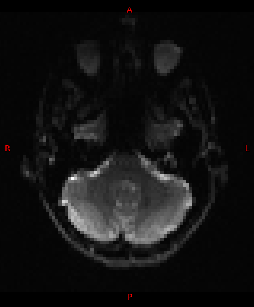
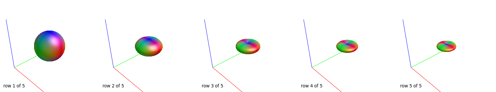
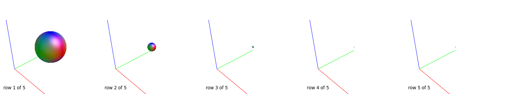

# 4. Diffusion Tractography Data Analysis Pipeline
## 4.1. Introduction
We analyse diffusion data with [MRtrix3](https://www.mrtrix.org/) and 
[FSL](https://fsl.fmrib.ox.ac.uk/fsl/fslwiki) using the steps described 
[below](#43-manual-analysis-steps). Co-registration of the tracts to the 
structural images is performed with 
[SPM](https://www.fil.ion.ucl.ac.uk/spm/software/spm12/).

We perform the following processing on the diffusion MRI data:
1. [Make directories to store data and results of analysis](#431-create-directories)
2. [Convert the DICOM data to MIF format and perform quality control checks](#432-convert-the-dicom-data-to-mif-format-and-perform-quality-control-checks)
3. [Denoise the data](#433-denoise-the-data)
4. [Remove Gibbs artefact from the data](#434-remove-the-gibbs-ringing-artefact)
5. [Correct for susceptibility and eddy current induced distortions and subject 
movements](#435-correct-for-susceptibility-and-eddy-current-induced-distortions-and-subject-movements)
6. [Estimate the response functions of white-matter, grey-matter and 
cerebro-spinal fluid for spherical deconvolution](#436-estimate-the-response-functions-of-white-matter-grey-matter-and-cerebro-spinal-fluid-for-spherical-deconvolution)
7. [Up-sample the data](#437-upsample-the-data)
8. [Create a brain mask](#438-create-a-brain-mask)
9. [Estimate the diffusion tensor and calculate the fractional anisotropy and 
first eigenvector maps](#439-estimate-the-diffusion-tensor-and-calculate-fractional-anisotropy-and-first-eigenvector-maps)
10. [Perform multi-shell multi-tissue constrained spherical deconvolution](#4310-perform-multi-shell-multi-tissue-constrained-spherical-deconvolution)
11. [Produce a map of the tissue volume fractions](#4311-produce-a-map-of-the-tissue-volume-fractions)
12. [Perform probabilistic tractography](#44-perform-probabilistic-tractography)
13. [Co-register the tracts to structural images](#45-co-register-tracts-to-structural-images)

>[!TIP]
>We include a [bash](https://www.gnu.org/software/bash) 
>[script](./scripts/mrtrix3_bash_pipeline) in this repository to illustrate how 
>steps 1-11 can be combined into a pipeline. 

## 4.2. Install Software
1. Install [MRtrix3](https://www.mrtrix.org/download/) by following the 
instructions online.
2. Install [FSL](https://fsl.fmrib.ox.ac.uk/fsl/fslwiki) by following the 
instructions on the 
[wiki](https://fsl.fmrib.ox.ac.uk/fsl/fslwiki/FSLInstallation).
3. Install [SPM](https://www.fil.ion.ucl.ac.uk/spm/software/spm12/) by following 
the instructions in the 
[online documentation](https://www.fil.ion.ucl.ac.uk/spm/docs/installation/). 

## 4.3. Manual Analysis Steps
The following 11 steps are carried out using the command-line.

>[!TIP]
>The MRtrix3 
>[documentation](https://mrtrix.readthedocs.io/en/latest/getting_started/command_line.html) 
>includes some helpful tips and advice about using the command-line.

### 4.3.1. Create Directories
1. Make directories to store the data and results of analysis:
    ```bash
    mkdir -p SURNAME_firstname/ana SURNAME_firstname/dcm
    ```
   
>[!TIP]
>Replace `SURNAME_firstname` with the subject's name 

>[!TIP]
>Skip this step if you have already created these directories when processing 
>the fMRI data.

2. Change to the `ana` directory:
    ```bash
    cd SURNAME_firstname/ana
    ```

3. Make a directories to store the results of the diffusion analysis, 
regions of interest (ROIs) and tracts: 
    ```bash
    mkdir -p mrtrix3/analysis mrtrix3/ROIs mrtrix3/tracts
    ```

4. Change to the analysis:
    ```bash
    cd mrtrix3/analysis
    ```
   
### 4.3.2. Convert the DICOM Data to MIF Format and Perform Quality Control Checks
>[!TIP]
>See the [MRtrix3 documentation](https://mrtrix.readthedocs.io/en/latest/tips_and_tricks/dicom_handling.html)
for further information on DICOM to mif conversion.

1. Move the [DICOM](https://dicom.nema.org/) files from the MRI study of the 
subject into the `SURNAME_firstname/dcm` directory using `mv` command.

>[!TIP]
>Skip this step if you have already moved the DICOM data to the `dcm` 
>directory when processing the fMRI data.

2. Convert the b = 0 $s/mm^2$ data acquired with phase-encode (PE) direction 
posterior-anterior (P>>A) from [DICOM](https://dicom.nema.org/)  to 
[mif](https://mrtrix.readthedocs.io/en/latest/getting_started/image_data.html) 
using 
[mrconvert](https://mrtrix.readthedocs.io/en/latest/reference/commands/mrconvert.html):
    ```bash
    mrconvert dcm_directory -coord 3 0 b0_PA.mif 
    ```
   
3. Check that the phase encode direction is P>>A, i.e. that the output of  
    [mrinfo](https://mrtrix.readthedocs.io/en/latest/reference/commands/mrinfo.html) 
    is `j`: 
    ```bash
    mrinfo -property PhaseEncodingDirection b0_PA.mif
    ```
   
>[!TIP]
> See [MRtrix3 documentation](https://mrtrix.readthedocs.io/en/latest/concepts/pe_scheme.html) 
> for a description of how phase encoding directions are stored in mif file header.
  
4.  Check that the b-value is 0 $s/mm^2$ i.e. that the output of 
[mrinfo](https://mrtrix.readthedocs.io/en/latest/reference/commands/mrinfo.html)
is `0`: 
    ```bash
    mrinfo -shell_bvalues b0_PA.mif 
    ```

5.  Visually check the image using 
    [mrview](https://mrtrix.readthedocs.io/en/latest/reference/commands/mrview.html):    
    ```bash
    mrview -quiet -mode 2 -load b0_PA.mif -interpolation 0
    ```
>[!TIP]
> If the PE direction is P>>A the eyes should appear squashed in the 
>anterior-posterior direction:
>
        
6. Convert the remaining diffusion weighted images with phase-encode 
direction anterior-posterior (A>>P) from DICOM to mif:
    ```bash
    mrconvert dcm_directory dwi_AP.mif 
    ```

>[!TIP]
>If you have acquired multiple b-values as separate series you can select 
>them all in a list when prompted by 
>[mrconvert](https://mrtrix.readthedocs.io/en/latest/reference/commands/mrconvert.html).

7. Check that the phase encode direction is A>>P, i.e. that the output of  
[mrinfo](https://mrtrix.readthedocs.io/en/latest/reference/commands/mrinfo.html) 
is `j-`:  
    ```bash
   mrinfo -property PhaseEncodingDirection dwi_AP.mif
    ```

8.  Check that the b-values are as expected i.e. for input data with 
b-values ranging from 0 to 2500 $s/mm^2$ that the output of 
[mrinfo](https://mrtrix.readthedocs.io/en/latest/reference/commands/mrinfo.html)
is `0 400 1000 1699.09 2497.33`: 

    ```bash
    mrinfo -shell_bvalues dwi_AP.mif 
    ```

8.  Visually check the data using 
[mrview](https://mrtrix.readthedocs.io/en/latest/reference/commands/mrview.html):
    ```bash
    mrview -quiet -mode 2 -load dwi_AP.mif -interpolation 0
    ```       

>[!TIP]
>If the PE direction is A>>P the eyes should appear stretched in the 
>anterior-posterior direction:
>

9. Concatenate all the volumes together using 
[mrcat](https://mrtrix.readthedocs.io/en/latest/reference/commands/mrcat.html):
    ```bash
    mrcat dwi_AP.mif  b0_PA.mif  dwi.mif
    ``` 

### 4.3.3. Denoise the Data
1. Denoise the data using 
[dwidenoise](https://mrtrix.readthedocs.io/en/latest/reference/commands/dwidenoise.html):

>[!CAUTION]
>The MRtrix3 [documentation](https://mrtrix.readthedocs.io/en/latest/reference/commands/dwidenoise.html) 
>explains that: _"Image denoising must be performed as the first step of the 
>image processing pipeline. The routine will fail if interpolation or smoothing 
>has been applied to the data prior to denoising."_ 
    
    ```bash
    dwidenoise dwi.mif dwi_denoise.mif 
    ```
       
2. Calculate the residual using 
[mrcalc](https://mrtrix.readthedocs.io/en/latest/reference/commands/mrcalc.html):
    ```bash
    mrcalc dwi.mif dwi_denoise.mif -subtract dwi_denoise_res.mif
    ```
       
3. Visually check the denoised data and residual using 
[mrview](https://mrtrix.readthedocs.io/en/latest/reference/commands/mrview.html):
    ```bash
    mrview -quiet -mode 2 -load dwi.mif -interpolation 0 -load dwi_denoise.mif  -interpolation 0 -load dwi_denoise_res.mif  -interpolation 0
    ```

    Examples of b = 0 $s/mm^2$ volumes before and after denoising are shown below:
            
     
         
along with the residual:
    


### 4.3.4. Remove the Gibbs Ringing Artefact
1. Remove the Gibbs ringing artefact from the DWI data with 
[mrdegibbs](https://mrtrix.readthedocs.io/en/latest/reference/commands/mrdegibbs.html):  

>[!CAUTION]
>The MRtrix3 
>[documentation](https://mrtrix.readthedocs.io/en/latest/reference/commands/mrdegibbs.html) 
>explains that: _"This command is designed to run on data directly after it has 
>been reconstructed by the scanner, before any interpolation of any kind has 
>taken place. You should not run this command after any form of motion 
>correction (e.g. not after `dwifslpreproc`). Similarly, if you intend running 
>`dwidenoise`, you should run denoising before this command to not alter the 
>noise structure, which would impact on `dwidenoise`'s performance."_ 

    ```bash
    mrdegibbs dwi_denoise.mif dwi_degibbs.mif
    ```
       
2. Visually check the data using 
[mrview](https://mrtrix.readthedocs.io/en/latest/reference/commands/mrview.html):
    ```bash
    mrview -quiet -mode 2 -load dwi_denoise.mif  -interpolation 0 -load dwi_degibbs.mif  -interpolation 0
    ```
        
    Examples of b = 0 $s/mm^2$ volumes before and after removal of Gibbs ringing
    are shown below:
            
     

### 4.3.5. Correct for Susceptibility and Eddy Current Induced Distortions and Subject Movements   
Correct for susceptibility and eddy current induced distortions and subject 
movements with [FSL](https://fsl.fmrib.ox.ac.uk/fsl/) tools
[topup](https://fsl.fmrib.ox.ac.uk/fsl/fslwiki/topup) and 
[eddy](https://fsl.fmrib.ox.ac.uk/fsl/fslwiki/eddy) via 
[dwifslpreproc](https://mrtrix.readthedocs.io/en/latest/reference/commands/dwifslpreproc.html):
    
1. Extract all the b = 0 $s/mm^2$ A>>P and P>>A volumes following the removal of the 
Gibbs ringing artefact with 
[dwiextract](https://mrtrix.readthedocs.io/en/latest/reference/commands/dwiextract.html):
    ```bash
    dwiextract -bzero dwi_degibbs.mif b0_degibbs.mif
   ```

2. Determine the total number of b = 0 $s/mm^2$ volumes (of either phase-encode 
direction) using 
[mrinfo](https://mrtrix.readthedocs.io/en/latest/reference/commands/mrinfo.html):
    ```bash
    b0_vols=$(mrinfo -shell_sizes b0_degibbs.mif)
    ```

3. Extract the last 2 images e.g. 1 b = 0 $s/mm^2$ volume with 
phase-encode direction A>>P followed by 1 b = 0 $s/mm^2$ volume with 
phase-encode direction P>>A using 
[mrconvert](https://mrtrix.readthedocs.io/en/latest/reference/commands/mrconvert.html):
    ```bash
    mrconvert b0_degibbs.mif -coord 3 $((b0_vols-2)):$((b0_vols-1)) b0_degibbs_AP_PA.mif
    ```
   
4. Check that the phase encode direction of the first volume is A>>P and 
that the second is P>>A, i.e. that the output of 
[mrinfo](https://mrtrix.readthedocs.io/en/latest/reference/commands/mrinfo.html): 
    ```bash
   mrinfo -property pe_scheme b0_degibbs_AP_PA.mif
    ```
    is of the form:
    ```bash
    0,-1,0,0.0252
    0,1,0,0.0252
    ```
   
>[!TIP]
>The MRtrix3 [documentation](https://mrtrix.readthedocs.io/en/latest/concepts/pe_scheme.html) 
>explains that: _"If the phase encoding direction varies between different 
>volumes within a single image series, then the two key-value fields described 
>above are not sufficient to fully encode this information. In this situation, 
>MRtrix3 will instead use a key-value entry `pe_scheme`. This information 
>is stored as a table, where each row contains the phase encoding direction and 
>the readout time for the corresponding volume. In each row, the first three 
>numbers encode the phase encoding direction, and the fourth number is the 
>total readout time. The direction is specified as a unit direction in the 
>image coordinate system; for instance, a phase encoding direction of A>>P 
>would be encoded as [ 0 -1 0 ]."_
         
5. Visually check that the resulting data has 2 volumes one with phase-encoding 
A>>P followed by one with phase-encoding P>>A using 
[mrview](https://mrtrix.readthedocs.io/en/latest/reference/commands/mrview.html):
    ```bash
    mrview -quiet -mode 2 -load b0_degibbs_AP_PA.mif -interpolation 0
    ```

6. Determine the number of DW volumes with phase-encoding direction A>>P using
[mrinfo](https://mrtrix.readthedocs.io/en/latest/reference/commands/mrinfo.html):
    ```bash
    dwi_AP_vols=$(mrinfo -size dwi_AP.mif | cut -d " " -f 4)
    ```
   
7. Extract the volumes with phase-encoding direction A>>P from the un-ringed 
diffusion data using 
[mrconvert](https://mrtrix.readthedocs.io/en/latest/reference/commands/mrconvert.html):
    ```bash
    mrconvert dwi_degibbs.mif -coord 3 0:$((dwi_AP_vols-1)) dwi_degibbs_AP.mif
    ```

8. Run [dwifslpreproc](https://mrtrix.readthedocs.io/en/latest/reference/commands/dwifslpreproc.html):
    ```bash
    dwifslpreproc dwi_degibbs_AP.mif dwi_tu_eddy.mif -align_seepi -rpe_pair -pe_dir AP -se_epi b0_degibbs_AP_PA.mif -eddy_options "--slm=linear --data_is_shelled"
    ```
   
9. Visually check the resulting data using 
[mrview](https://mrtrix.readthedocs.io/en/latest/reference/commands/mrview.html):
    ```bash
    mrview -quiet -mode 2 -load dwi_degibbs.mif -interpolation 0 -load dwi_tu_eddy.mif -interpolation 0
    ``` 
    Examples of b = 0 $s/mm^2$ volume before and after correction with topup 
    and eddy are shown below:
      
    

### 4.3.6. Estimate the Response Functions of White-matter, Grey-matter and Cerebro-spinal Fluid for Spherical Deconvolution
Estimate the response functions of white-matter (WM), grey-matter (GM) and 
cerebro-spinal fluid (CSF) for spherical deconvolution using 
[dwi2response](https://mrtrix.readthedocs.io/en/latest/reference/commands/dwi2response.html):

>[!TIP] 
>If you only have single-shell diffusion data then there are two different 
>options for data processing described on the MRtrix3 discussion boards 
>[a](https://community.mrtrix.org/t/lmaxes-specified-does-not-match-number-of-tissues/500/13) and 
>[b](https://community.mrtrix.org/t/wm-odf-and-response-function-with-dhollander-option---single-shell-versus-multi-shell/572/5). 
>Option a uses the `tournier` algorithm for the WM response and `csd` for 
>single-shell single-tissue CSD. Whereas option b uses the `dhollander` 
>algorithm for WM, GM and CSF responses and `msmt_csd` for multi-tissue CSD 
>with only WM and CSF. Option b is preferable because essentially it makes all 
>false positive "WM FODs" in the CSF disappear, and improves the quality of the 
>WM FODs when partial voluming with extra-cellular free water happens.

1. Calculate the response using the dhollander algorithm:
    ```bash
    dwi2response dhollander dwi_tu_eddy.mif response_wm.txt response_gm.txt response_csf.txt -voxels response_voxels.mif
    ```

2. Visually check the response functions data using 
[shview](https://mrtrix.readthedocs.io/en/latest/reference/commands/shview.html):
    ```bash
    shview response_wm.txt
    shview response_gm.txt
    shview response_csf.txt
    ```
   
    Examples of response functions for white-matter:
       
    
       
    grey-matter:
       
    
       
    and CSF:
    
    
       
3. Visually check the response voxels using 
[mrview](https://mrtrix.readthedocs.io/en/latest/reference/commands/mrview.html):
    ```bash
    mrview -quiet -mode 2 -load dwi_tu_eddy.mif -interpolation 0 -overlay.load response_voxels.mif -overlay.interpolation 0
    ```
    
    Examples of response voxels are shown below:
    
    

>[!TIP]
>In the repsonse voxels map white-matter is shown in blue, grey-matter in green 
>and CSF in red.

### 4.3.7. Upsample the Data
Upsample the DWI data with 
[mrgrid](https://mrtrix.readthedocs.io/en/latest/reference/commands/mrgrid.html):
   
```bash
 mrgrid dwi_tu_eddy.mif regrid -voxel 1.3 dwi_tu_eddy_upsamp.mif
```

>[!TIP] 
>The MRtrix3 [documentation](https://mrtrix.readthedocs.io/en/latest/fixel_based_analysis/mt_fibre_density_cross-section.html#upsampling-dw-images) 
>explains that: _"upsampling DWI data before computing FODs increases 
>anatomical contrast and improves downstream template building, registration, 
>tractography and statistics. We recommend upsampling to an isotropic voxel 
>size of 1.3 mm for human brains."_
   
### 4.3.8. Create a Brain Mask
Create a brain mask with FSL [bet](https://fsl.fmrib.ox.ac.uk/fsl/fslwiki/BET/UserGuide):

>[!TIP] 
>`dwi2mask` in combination with `dwibiascorrect` with the -fsl option doesn't 
>seem to be very reliable so we use bet instead.
    
1. Extract the first b = 0 $s/mm^2$ volume from the upsampled data in NIfTI 
format using [dwiextract](https://mrtrix.readthedocs.io/en/latest/reference/commands/dwiextract.html):
    ```bash
    dwiextract -bzero dwi_tu_eddy_upsamp.mif - | mrconvert - -coord 3 0 b0_upsamp.nii
    ```    
   
2. Create a brain mask with bet with `f` and `g` parameters set to 0.35 and 
0.1 respectively:
    ```bash
    bet b0_upsamp.nii b0_upsamp -n -m -f 0.35 -g 0.1
    ```
   
3. Convert the mask from NIfTI to mif format using 
[mrconvert](https://mrtrix.readthedocs.io/en/latest/reference/commands/mrconvert.html):
    ```bash
    mrconvert b0_upsamp_mask.nii.gz b0_upsamp_mask.mif
    ```
   
4. Check the resulting mif format mask using 
[mrview](https://mrtrix.readthedocs.io/en/latest/reference/commands/mrview.html):
    ```bash
    mrview -quiet -mode 2 -load b0_upsamp.nii -interpolation 0 -roi.load b0_upsamp_mask.mif -roi.opacity 0.6
    ```
   
   As example mask is shown below:
    
    

### 4.3.9. Estimate the Diffusion Tensor and Calculate Fractional Anisotropy and First Eigenvector Maps
1. Estimate the diffusion tensor with 
[dwi2tensor](https://mrtrix.readthedocs.io/en/latest/reference/commands/dwi2tensor.html):
    ```bash
    dwi2tensor -mask b0_upsamp_mask.mif dwi_tu_eddy_upsamp.mif dt.mif
    ```
    
2. Calculating the fractional anisotropy (FA) and first eigenvector (EV) maps with 
[tensor2metric](https://mrtrix.readthedocs.io/en/latest/reference/commands/tensor2metric.html):
    ```bash
    tensor2metric -mask b0_upsamp_mask.mif -fa fa.mif -vector ev.mif dt.mif
    ```
    
3. Visually check the resulting FA and EV maps using 
[mrview](https://mrtrix.readthedocs.io/en/latest/reference/commands/mrview.html):
    ```bash
    mrview -quiet -mode 2 -load fa.mif -interpolation 0 -load ev.mif -interpolation 0 -odf.load_tensor dt.mif
    ```
    
    Examples of FA and EV maps are shown below:
           
     
    
    As well as the diffusion tensor in the corpus callosum:
    
    

>[!TIP]
>In the EV map principal diffusion direction right-left is shown in red, 
>anterior-posterior in green and superior-inferior in blue.

### 4.3.10. Perform Multi-Shell Multi-Tissue Constrained Spherical Deconvolution    
Perform multi-shell multi-tissue constrained spherical deconvolution with 
[dwi2fod](https://mrtrix.readthedocs.io/en/latest/reference/commands/dwi2fod.html):

1. If the data is single-shell i.e. b-values of 0 and 2500 $s/mm^2$:  
    ```bash
    dwi2fod msmt_csd -mask b0_upsamp_mask.mif dwi_tu_eddy_upsamp.mif response_wm.txt wm_fod.mif response_csf.txt csf_fod.mif
    ```
   
2. Or if the data is multi-shell i.e. b-values of 0, 700, 1400 and 2500 $s/mm^2$:
    ```bash
    dwi2fod msmt_csd -mask b0_upsamp_mask.mif dwi_tu_eddy_upsamp.mif response_wm.txt wm_fod.mif response_gm.txt gm_fod.mif response_csf.txt csf_fod.mif
    ```
   
3. Visually check the resulting white-matter FODs using 
[mrview](https://mrtrix.readthedocs.io/en/latest/reference/commands/mrview.html):
    ```bash   
    mrview -quiet -mode 2 -load fa.mif -interpolation 0 -load ev.mif -interpolation 0 -odf.load_sh wm_fod.mif
    ```
   Example of the white-matter FOD in the corpus callosum is shown below:
   
   

### 4.3.11. Produce a Map of the Tissue Volume Fractions
1. If data is multi-shell create the map of tissue volume fractions using 
[mrconvert](https://mrtrix.readthedocs.io/en/latest/reference/commands/mrconvert.html) and 
[mrcat](https://mrtrix.readthedocs.io/en/latest/reference/commands/mrcat.html):
    ```bash
    mrconvert -coord 3 0 wm_fod.mif - | mrcat csf_fod.mif gm_fod.mif - tissue_vf.mif
    ```
   
2. Visually check the result using 
[mrview](https://mrtrix.readthedocs.io/en/latest/reference/commands/mrview.html):
    ```bash
    mrview -quiet -mode 2 -load tissue_vf.mif -interpolation 0
    ```
   An example tissue volume fraction map is shown below:
    
    

>[!TIP]
>In the tissue volume fraction map white-matter is shown in blue, grey-matter 
>in green and CSF in red.

## 4.4. Perform Probabilistic Tractography
Dissect the arcuate fasciculus, cortico-spinal tracts and the optic radiation 
using probabilistic tractography using the 
[iFOD2 algorithm](https://mrtrix.readthedocs.io/en/latest/reference/commands/tckgen.html) 
in MRtrix3.

### 4.4.1. Draw Regions of Interest
Use [mrview](https://mrtrix.readthedocs.io/en/latest/reference/commands/mrview.html) 
to draw the regions of interest (ROIs) needed to perform tractography:

1. Open [mrview](https://mrtrix.readthedocs.io/en/latest/reference/commands/mrview.html):
    ```bash   
    mrview -quiet -mode 2 -load fa.mif -interpolation 0 -load ev.mif -interpolation 0
    ```
2. From the Tool menu select ROI editor
3. Create a new ROI and edit it (see below for details of where to place each 
ROI)
4. Save the ROI in mif format 

### 4.4.2. Arcuate Fasciculus
The arcuate fasciculus (AF) is a set of association fibres connecting 
Broca’s area in the inferior frontal gyrus and Wernicke’s area in the superior 
temporal gyrus. Three regions of interest (ROIs) are needed to successfully 
dissect the AF: 

#### 4.4.2.1. Vertical Section of the AF
The vertical section of the AF can be identified on a sagittal view of an EV map. 
To find it start from the most lateral sagittal slice and move medially through 
the slices until a *backwards c-shaped* structure can be identified (highlighted
on the image below with a white line). The ROI is the (blue) region of fibres 
running superior-inferior.


Place the ROI on an axial slice perpendicular to the vertical fibres as shown
below:

    

Save the ROI as `AFv.mif` in the `mrtrix3/ROIs` directory.

#### 4.4.2.2. Superior Longitudinal Fasciculus
The section of the superior longitudinal fasciculus (SLF) and AF running in 
the anterior-posterior direction can be identified on the sagittal slice 
identified above. It is the (green) region of fibres running anterior-posterior. 

Place the ROI on a coronal slice perpendicular to the fibres as shown below:

    

Save the ROI as `SLFc.mif` in the `mrtrix3/ROIs` directory.

#### 4.4.2.3. Broca’s Area
Broca’s area can be identified from a sagittal view of an EV map. 
To find it start from the most lateral sagittal slice and move medially 
through the slices until the *M-shaped* inferior frontal gyrus is seen. 
This gyrus is made up of the pars opercularis, pars triangularis and pars 
orbitalis. 

Place the ROI on a sagittal slice perpendicular to the fibres 
encompassing the inferior frontal gyrus, middle frontal gyrus and the inferior 
part of the pre-central gyrus as shown below:

   

Save the ROI as `Broca.mif` in the `mrtrix3/ROIs` directory.

### 4.4.3. Cortico-spinal Tracts
The cortico-spinal tracts (CST) are a set of projection fibres connecting the 
primary motor cortex to the brainstem. Four ROIs are needed to successfully 
the hand, foot and lip tracts:

#### 4.4.3.1. Hand Area
The motor hand area can normally be identified anatomically from an axial slice 
of an FA map. Start from the most superior axial slice and move down through 
the slices until the central sulcus is visible. 

Place the ROI in the "hand knob" in the pre-central gyrus as shown below:

  

Save the ROI as `HandM1.mif` in the `mrtrix3/ROIs` directory.

>[!TIP]
>Normal variations in the anatomy of the hand area are shown in Figure 1 of 
>[M.Caulo et. al. AJNR 2007](http://www.ajnr.org/content/28/8/1480) which is
>reproduced below:
>  

>[!TIP]
>In the case where it is difficult to identify the motor hand area anatomically 
>it may be found using the area of fMRI activation in the pre-central gyrus 
>resulting from a 
>[finger tapping paradigm](./fmri_paradigms/motor/hands/Motor_Hands.md). 

#### 4.4.3.2. Foot Area
The foot area or paracentral lobule can normally be identified anatomically from 
an axial slice of an FA map. Start from the most superior axial slice and move 
down through the slices until the central sulcus is visible. The foot area 
starts here and runs slightly inferior to this at the point where the pre and 
post central sulci join at their most medial aspect.

Place the ROI as shown below:
  

Save the ROI as `Foot.mif` in the `mrtrix3/ROIs` directory.

#### 4.4.3.3. Lip Area
The motor lip area in the pre-central gyrus is difficult to identify anatomically.
It should be identified from the area of fMRI activation in the pre-central 
gyrus resulting from a 
[lip pursing paradigm](./fmri_paradigms/motor/lips/Motor_Lips.md). 

Save the ROI as `Lips.mif` in the `mrtrix3/ROIs` directory.

#### 4.4.3.4. Cerebral Peduncles
The cerebral peduncles can be identified from an axial view of an EV map. 
To find them start from the most inferior axial slice and move up through the 
slices until a *mickey-mouse shaped* structure of the midbrain is seen. 

Place the ROI in an axial slice through the purple region of fibres as shown 
below:

  

Save the ROI as `Ped.mif` in the `mrtrix3/ROIs` directory. 

### 4.4.4. Optic Radiation
The optic radiation (OR) is a set of projection fibres connecting the primary 
visual cortex to the lateral geniculate nucleus. Three regions of interest are 
needed to dissect the OR:

#### 4.4.4.1. White-matter Adjacent to the Lateral Geniculate Nucleus
The region of white-matter adjacent to the LGN can be identified from a 
coronal view of an EV map. It is directly inferior to the thalamus.

Place the ROI as shown below:

  

Save the ROI as `LGNArea.mif` in the `mrtrix3/ROIs` directory.

#### 4.4.4.2. Lateral to the Ventricle 
Place the ROI lateral to the lateral ventricle on a coronal view 
of an FA map as shown below: 

  

Save the ROI as `LatVentr.mif` in the `mrtrix3/ROIs` directory.

#### 4.4.4.3. Calcarine Area
The lateral Calcarine area can be identified from a sagittal view of an FA map. 
To find it start from the midline and move laterally through the slices until 
the calcarine sulcus is seen. 

Place the ROI through a region above and below 
the sulcus.

  

Save the ROI as `LatCalc.mif` in the `mrtrix3/ROIs` directory.

### 4.4.5. Perform Probabilistic Tractography
Change to the `mrtrix3` directory using the `cd` command.

1. Perform probabilistic tractography using
[tckgen](https://mrtrix.readthedocs.io/en/latest/reference/commands/tckgen.html)
with `AFv.mif` as the seed:
    ```bash   
    tckgen analysis/wm_fod.mif -seed_image ROIs/AFv.mif -include ROIs/SLFc.mif -include ROIs/Broca.mif tracts/AFvToBrocaViaSLFc.tck
    tckgen analysis/wm_fod.mif -seed_image ROIs/HandM1.mif -include ROIs/Ped.mif tracts/HandM1ToPed.tck 
    tckgen analysis/wm_fod.mif -seed_image ROIs/Foot.mif -include ROIs/Ped.mif tracts/FootToPed.tck 
    tckgen analysis/wm_fod.mif -seed_image ROIs/Lips.mif -include ROIs/Ped.mif tracts/LipsToPed.tck 
    tckgen analysis/wm_fod.mif -seed_image ROIs/LGNArea.mif -include ROIs/LatVentr.mif -include ROIs/LatCalc.mif -cutoff 0.01 -seed_unidirectional tracts/LGNAreaToLatCalcViaLatVentr.tck
    ```
>[!TIP]
>For the optic radiation the `-seed_undirectional` option set to avoid 
artefactual tracts and `-cutoff 0.01` to ensure Meyer's loop is visualised

2. View the tract streamlines using 
[mrview](https://mrtrix.readthedocs.io/en/latest/reference/commands/mrview.html):
    ```bash   
    mrview -quiet -mode 2 -load analysis/fa.mif -interpolation 0 -tractography.load tracts/AFvToBrocaViaSLFc.tck -tractography.load tracts/HandM1ToPed.tck -tractography.load tracts/FootToPed.tck tracts/LipsToPed.tck -tractography.load tracts/LGNAreaToLatCalcViaLatVentr.tck
    ```
   
### 4.4.6. Create Track Density Image
1. Convert the streamlines (tck) to a track density image (mif) using 
[tckmap](https://mrtrix.readthedocs.io/en/latest/reference/commands/tckmap.html):
    ```bash
    tckmap -template analysis/fa.mif tracts/AFvToBrocaViaSLFc.tck tracts/AFvToBrocaViaSLFc.mif
    tckmap -template analysis/fa.mif tracts/HandM1ToPed.tck tracts/HandM1ToPed.mif
    tckmap -template analysis/fa.mif tracts/FootToPed.tck tracts/FootToPed.mif
    tckmap -template analysis/fa.mif tracts/LipsToPed.tck tracts/LipsToPed.mif
    tckmap -template analysis/fa.mif tracts/LGNAreaToLatCalcViaLatVentr.tck tracts/LGNAreaToLatCalcViaLatVentr.mif
    ```
   
2. Normalise the voxel intensities based on the track count:
    1. Determine the number of tracts using 
    [tckinfo](https://mrtrix.readthedocs.io/en/latest/reference/commands/tckinfo.html) 
    (we'll refer to these as N_tracts_AF, N_tracts_hand, N_tracts_foot, 
    N_tracts_lips and N_tracts_OR respectively):
        ```bash
        tckinfo -count tracts/AFvToBrocaViaSLFc.tck   
        tckinfo -count tracts/HandM1ToPed.tck
        tckinfo -count tracts/FootToPed.tck
        tckinfo -count tracts/LipsToPed.tck
        tckinfo -count tracts/LGNAreaToLatCalcViaLatVentr.tck
        ```
       
    2. Normalise using [mrcalc](https://mrtrix.readthedocs.io/en/latest/reference/commands/mrcalc.html):
        ```bash   
        mrcalc tracts/AFvToBrocaViaSLFc.mif N_tracts_AF -div tracts/AFvToBrocaViaSLFc_norm.nii
        mrcalc tracts/HandM1ToPed.mif N_tracts_hand -div tracts/HandM1ToPed_norm.nii
        mrcalc tracts/FootToPed.mif N_tracts_foot -div tracts/FootToPed_norm.nii
        mrcalc tracts/LipsToPed.mif N_tracts_lips -div tracts/LipsToPed_norm.nii
        mrcalc tracts/LGNAreaToLatCalcViaLatVentr.mif N_tracts_OR -div tracts/LGNAreaToLatCalcViaLatVentr_norm.nii
        ```

>[!TIP]
>It is possible to combine the commands in steps 1. and 2. into a single command 
>using [for_each](https://mrtrix.readthedocs.io/en/latest/reference/commands/for_each.html)
>and some [shell gymnastics](https://community.mrtrix.org/t/tracks2prob-and-tckmap/1076)
>with grep, cut, tr and pipes, i.e. from within the `mrtrix3/tracts` directory
>run:
>
```bash
for_each *.tck : tckmap IN -template ../analysis/fa.mif - \|mrcalc - \$\(tckinfo IN \| grep " count" \| cut -d ":" -f 2 \| tr -d [:blank:]\) -div PRE_norm.nii
```     

3. View the track density images using 
[mrview](https://mrtrix.readthedocs.io/en/latest/reference/commands/mrview.html):
    ```bash   
    mrview -quiet -mode 2 -load analysis/fa.mif -interpolation 0 -overlay.load tracts/AFvToBrocaViaSLFc_norm.nii -overlay.load tracts/HandM1ToPed_norm.nii -overlay.load tracts/FootToPed_norm.nii overlay.load tracts/LipsToPed_norm.nii -overlay.load tracts/LGNAreaToLatCalcViaLatVentr_norm.nii
    ```

Example track density images are shown below:
- Arcuate Fasciculus:
     
      
- Cortico-Spinal Tracts:
    
    Note: The lip CST is **not** shown in the image above.
    
- Optic Radiation:
    

## 4.5. Co-register Tracts to Structural Images

>[!TIP]
>If you didn't perform the [fMRI data analysis](./3_fMRI_Analysis_Pipeline.md) 
>you will need to convert the structural MRI data from NIfTI to DICOM format 
>using `dcm2niix` and place the resulting NIfTI and JSON files in a directory 
>called `ana/structural` before attempting to perform co-registration.

### 4.5.1. Open SPM
1. Start [MATLAB](https://uk.mathworks.com)
   
2. Open [SPM](https://www.fil.ion.ucl.ac.uk/spm/software/spm12/) by typing in 
the [MATLAB](https://uk.mathworks.com) Command Window:
    ```matlab
    spm fmri
    ``` 
   
### 4.5.2. Edit and Run a Subject Specific SPM Batch File
Create an SPM batch file with the subject specific details needed to perform
co-registration:

1. Open the Batch Editor by clicking the `Batch` button in the SPM menu window

2. In the Batch Editor, select `Load Batch` from the `File` menu. Load 
the co-registration [batch file](./spm_batches/coregister_job.m).

3. In the Batch Editor select only module `Coregister: Estimate & Reslice` 
from the Module List. 

4. Select `Reference Image <-X`, click `Specify...`. In the 
pop-up window select the `structural/0001-t1_space.nii` file and click 
`Done`.

5. Select `Source Image <-X`, click `Specify...`. In the 
pop-up window select the `mrtrix3/analysis/b0_upsamp.nii` file and click 
`Done`.

6. Select `Other Images <-X`, click `Specify...`. In the 
pop-up window select all the intensity normalised track density files
i.e. `mrtrix3/tracts/*_norm.nii` and click `Done`.

7. In the Batch Editor, select `Save Batch` from the `File` menu. Save the batch 
file in the `ana` directory so that you have a record of the co-registration 
parameters that were used for this subject.

8. Select `Run Batch` from the `File` menu.

### 4.5.3. Check Co-Registration
#### 4.5.3.1. Quick Check
Visually check the overlap of the co-registered images:

>[!TIP]
>A snapshot of the registration is shown in the PostScript output file, this 
>can be used to check the quality of the registrations.
 
>[!TIP]
>If the co-registered images do not overlap as expected then the 
>`Registration options` in the `Co-register: Estimate & Reslice` module can be 
>changed and the analysis re-run to see if the co-registration has improved.

#### 4.5.3.2. Detailed Checks
##### 4.5.3.2.1. SPM GUI
1. From the SPM Menu window select `Check Reg`. In the pop-up window select the 
reference images e.g. `structural/0001-t1_space.nii` and the source image e.g. 
`mrtrix3/analysis/rb0_upsamp.nii`. Click `Done`.

2. The quality of the registration can be checked in the Graphics window 
    1. using the cross-hairs to check if the images overlap OR
    2. by displaying contours of the source image over the reference image by 
right-clicking on the source image and selecting 
`Contour > Display onto > all but current`. 

##### 4.5.3.2.2.  FSLeyes 
1. Open the reference image e.g. `structural/0001-t1_space.nii` and the source 
image e.g. `mrtrix3/analysis/rb0_upsamp.nii` in 
[FSLeyes](https://fsl.fmrib.ox.ac.uk/fsl/fslwiki/FSLeyes) by typing at the 
command prompt:
    ```bash
    fsleyes structural/0001-t1_space.nii mrtrix3/analysis/rb0_upsamp.nii
    ```
2. Toggle between the two images to check to check the quality of the 
registration.

>[!TIP]
>[FSLeyes](https://fsl.fmrib.ox.ac.uk/fsl/fslwiki/FSLeyes) can be used to view
>all of the co-registered tract images overlayed on the structural images i.e.:

```bash
fsleyes structural/0001-t1_space.nii structural/r0005-t2_space.nii structural/r0006-t2_flair_space.nii mrtrix3/tracts/r*_norm.nii
```
